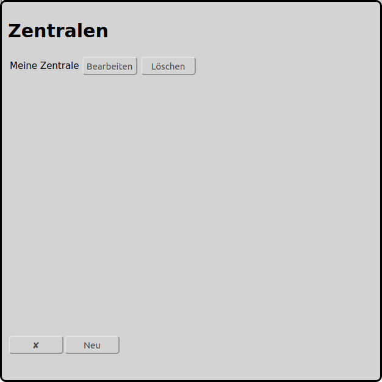

# Konfiguration der Zentralen
Im Hauptbildschirm kann man über das Icon  zur Konfiguration der Zentralen gelangen:

Im obigen Beispiel ist bereits eine Zentrale mit dem Namen "Meine Zentrale" angelegt worden.

Unten gibt es einen Butten "Neu", damit kann eine weitere Zentrale angelegt werden.

Üblicherweise ist pro Modelleisenbahn lediglich eine Zentrale vorhanden und zu erfassen. Bei großen Anlagen können auch mehrere Zentralen erfasst werden, so dass die Steuerung der Lokomotiven, der Zubehörartikel und der Rückmelder getrennt werden kann.

RailControl unterstützt zur Zeit folgende Zentralen:

* Arduino 	DCC-EX (formerly DCC++EX formerly DCC++)
* CAN-Digital-Bahn 	[CC-Schnitte 2.1](#configuration-of-cc-schnitte)
* Digikejis 	DR5000
* ESU 	ECoS/Central Station Reloaded
* Fleischmann 	[Twin-Center](#configuration-of-fleischmann-twin-center)
* LDT 	[HSI-88 RS232](#configuration-of-hsi-88-rs232)
* KM-1 	System Control 7
* Märklin 	[Central Station 2/3 with TCP (new)](#konfiguration-der-märklin-central-station-23-cs23-mit-tcp-neu)
* Märklin 	[Central Station 2/3 with UDP (old)](#konfiguration-der-märklin-central-station-23-cs23-mit-udp-alt)
* Märklin 	[Interface 6050/6051](#konfiguration-des-märklin-interfaces-60506051)
* OpenDCC 	[OpenDCC Z1](#konfiguration-der-opendcc-z1)
* Roco 	[Z21/z21](#konfiguration-der-roco-z21)
* Tams 	[MasterControl](#konfiguration-der-tams-mastercontrol)
* Tams 	[MasterControl 2](#konfiguration-der-tams-mastercontrol-2)
* Tams 	[RedBox](#konfiguration-der-tams-redbox)
* Uhlenbrock 	Adapter 63120
* Uhlenbrock 	Adapter 63820
* Uhlenbrock 	[Intellibox](#konfiguration-der-uhlenbrock-intellibox)
* Uhlenbrock 	Intellibox II

