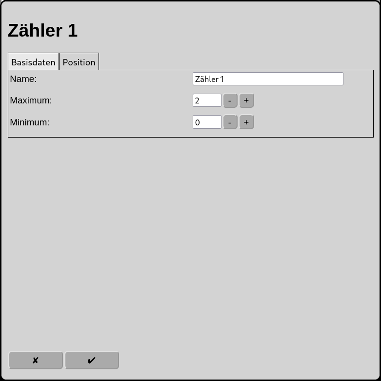
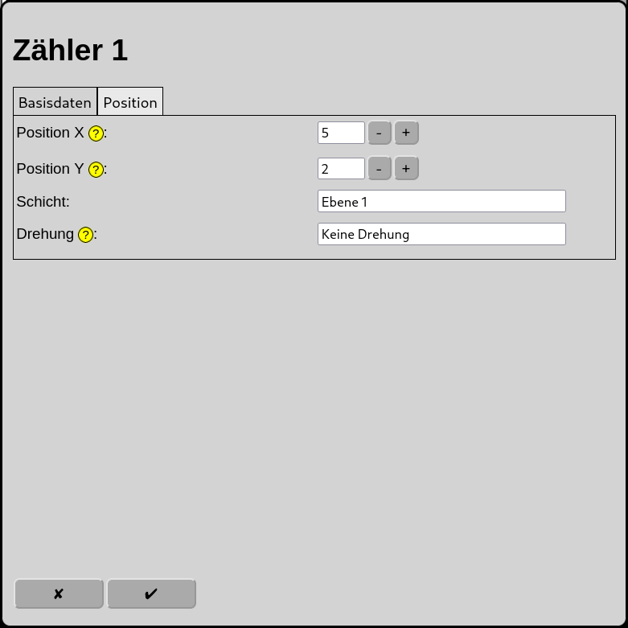

# Konfiguration der Zähler
Im Hauptbildschirm gelangt man über das Symbol  zur Konfiguration der Zähler.

Zähler werden im Automatikbetrieb benutzt um die Anzahl reservierter Fahrstraßen in einem Gleisnetz zu begrenzen, falls sich Fahrstraßen gegenseitig blockieren könnten.

Zähler werden beim Reservieren einer Fahrstraße entweder ums 1
* erhöht und beim Freigeben wieder reduziert oder
* reduziert und beim Freigeben wieder erhöht.

Eine Fahrstraße kann keinen oder beliebig viele Zähler beeinflussen. Jeder Zähler hat einen Maximal- und Minimalwert, beide stellt der Benutzer ein.
Hat ein Zähler seinen Maximal- bzw. Minimalwert erreicht, so wird eine Fahrstraße während des Reservierens blockiert bis es wieder möglich ist den Wert wieder zu erhöhen bzw. zu reduzieren.

## Basisdaten

### Name
Der Name des Zählers ist eine eindeutige Identifikation. Wird kein eindeutiger Name vergeben, so wird ein eindeutiger Name gewählt oder der Name wird mit einer Nummer ergänzt um ihn eindeutig zu machen.

### Maximum
Der höchste Wert welchen der Zähler erreichen darf. Ist dieser Maximalwert erreicht wird der Reserviervorgang der Fahrstraße blockiert die den Zähler weiter erhöhen will. Der Wertebereich ist positiv, einschließlich null.

### Minimum
Der niedrigste Wert welchen der Zähler erreichen darf. Ist dieser Minimalwert erreicht wird der Reserviervorgang der Fahrstraße blockiert die den Zähler weiter reduzieren will. Der Wertebereich ist negativ, einschließlich null.

## Position

Zähler werden in der Übersicht als gerades Gleis mit dem aktuellen Wert des Zählers daneben dargestellt.

### Position X
Die Position des Zählers in Quadraten ab dem linken Rand des Gleisbildes. Es wird bei null angefangen zu zählen.

### Position Y
Die Position des Zählers in Quadraten ab dem oberen Rand des Gleisbildes. Es wird bei null angefangen zu zählen.

### Schicht
Die Ebene auf welcher der Zähler sichtbar sein soll.

### Drehung
Die Darstellung des Zählers mit Gleis kann in 90 Grad Schritten gedreht werden.

