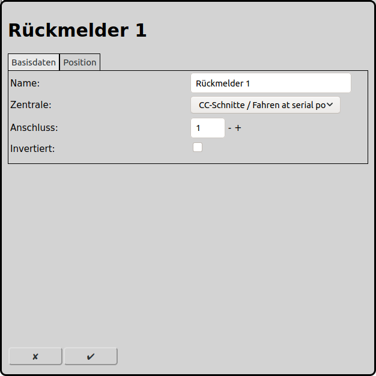
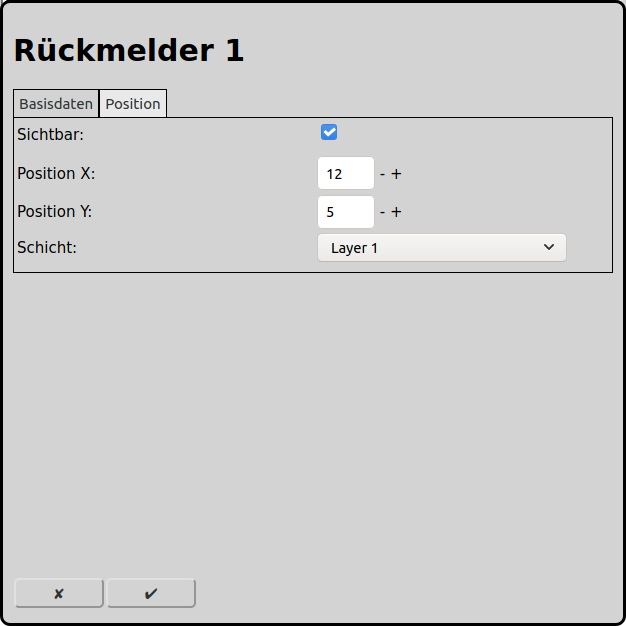

# Konfiguration der Rückmelder
Im Hauptbildschirm kann man über das Icon  zur Konfiguration der Rückmelder gelangen.

Rückmelder werden im Automatikbetrieb benötigt, damit RailControl die Position der Züge mitverfolgen und entsprechend reagieren kann. Einerseits ist die Gleisbelegung wichtig, andererseits muss RailControl einen Zug anhalten, wenn dieser sein Ziel erreicht hat.

## Basisdaten

### Name
Der Name des Rückmelders ist eine eindeutige Identifikation. Wird kein eindeutiger Name vergeben, so wird ein eindeutiger Name gewählt oder der Name wird mit einer Nummer ergänzt um ihn eindeutig zu machen.

### Zentrale
Sind mehrere rückmeldefähige Zentralen an RailControl konfiguriert, so muss die Zentrale ausgewählt werden, an der dieser Rückmelder angeschlossen ist. Ist nur eine rückmeldefähige Zentrale konfiguriert  so wird das Auswahlfeld nicht angezeigt.

### Anschluss
Die Nummer des physikalischen Anschlusses, unter welchem der Rückmelder der Zentrale bekannt ist. Bei den meisten Zentralen ist die Nummerierung kontinuierlich aufsteigend. Manche Zentralen haben komplizierte Berechnungen des Anschlusses. Bitte hierzu die Dokumentation der Zentrale und/oder der Rückmelder konsultieren.

Ist nicht klar, welche Nummer der Anschluss hat, so kann in den [allgemeinen Einstellungen](#allgemeine-einstellungen) "Füge unbekannte Rückmelder automatisch hinzu" angewählt werden. Damit werden unbekannte Rückmelder die betätigt werden automatisch in RailControl übernommen. Diese sind dann in der Übersicht der jeweiligen Zentrale sichtbar.

### Invertiert
Die Logik der Rückmelder kann damit invertiert werden. Üblicherweise wird ein geschlossener Rückmelder als aktiv interpretiert. Wenn hingegen ein offener Rückmelder ein besetztes Gleis anzeigt muss die Logik hier invertiert werden.

## Position

### Sichtbar
Ein Rückmelder kann auf dem Gleisbildstellpult angezeigt werden oder eben nicht. Wenn ein Rückmelder einem Gleis zugeordnet ist, so wird der kumulierte Zustand am Gleis selbst angezeigt. Deshalb ist eine separate Anzeige des Rückmelders nur noch bedingt sinnvoll und kann ausgeschaltet werden. In jedem Fall wird ein Rückmelder auf der Schicht der Zentrale angezeigt.

Wenn der Rückmelder nicht sichtbar sein soll, werden die folgenden Eingabefelder ausgeblendet.

### Position X
Die Position des Elements in Quadraten ab dem linken Rand des Gleisbildes. Es wird bei null angefangen zu zählen.

### Position Y
Die Position des Elements in Quadraten ab dem oberen Rand des Gleisbildes. Es wird bei null angefangen zu zählen.

### Schicht
Die Schicht auf der das Element sichtbar sein soll.

