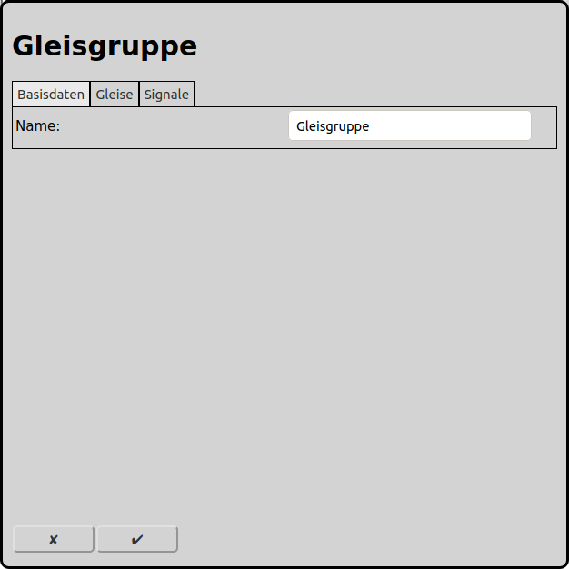
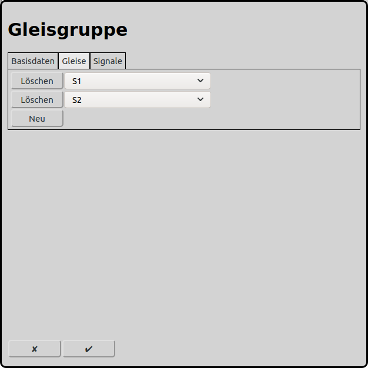

# Konfiguration der Gleisgruppen
Im Hauptbildschirm kann man über das Icon  zur Konfiguration der Gleisgruppen gelangen.

Gleisgruppen haben ausschliesslich im Automatikbetrieb eine Auswirkung. Alle Gleise der Gruppe können gleichzeitig nur in derselben Richtung befahren werden. Damit kann verhindert werden, dass von beiden Seiten einer einspurigen Strecke ein Zug auf die Strecke fährt. Ein zweiter Zug kann jedoch einem ersten Zug auf die einspurige Strecke folgen.

## Basisdaten

### Name
Jede Gleisgruppe benötigt einen eindeutigen Namen. Wird kein eindeutiger Name vergeben, so wird ein eindeutiger Name gewählt oder der Name wird mit einer Nummer ergänzt um ihn eindeutig zu machen.

## Gleise

Hier können alle Gleise eingetragen werden, die nur in derselben Richtung befahren werden dürfen.

## Signale
Obsolet. Wird nur noch angezeigt, wenn schon Signale konfiguriert waren. Wird in künftigen Versionen ganz entfernt werden.

