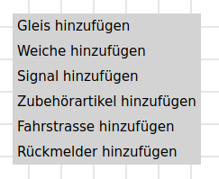

# Konfiguration der Schichten
Im Hauptbildschirm kann man über das Icon  zur Konfiguration der Schichten gelangen. Damit können mehrere Schichten erstellt und bearbeitet werden, zwischen denen ausgewählt werden kann.

Auf der rechten Seite des Bildschirmes kann ein Gleisbild der Modelleisenbahn konfiguriert und angezeigt werden. Dabei können Gleise, Weichen, Signale und Rückmelder erfasst, bearbeitet und bedient werden.

Mit der rechten Maustaste auf einen leeren Bereich im Gleisbild können zusätzliche Elemente an diesem Ort hinzugefügt werden:

