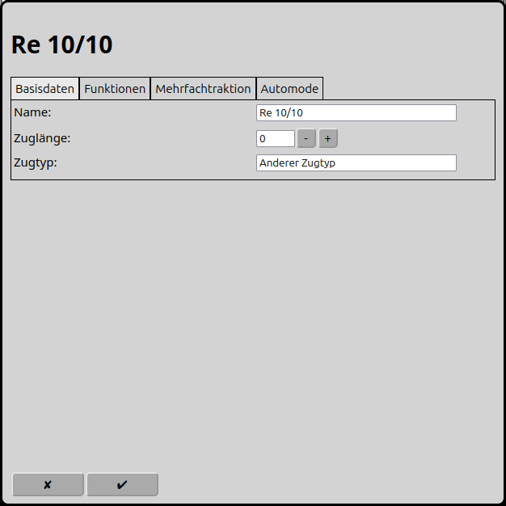
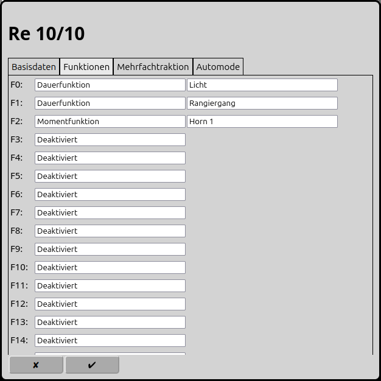
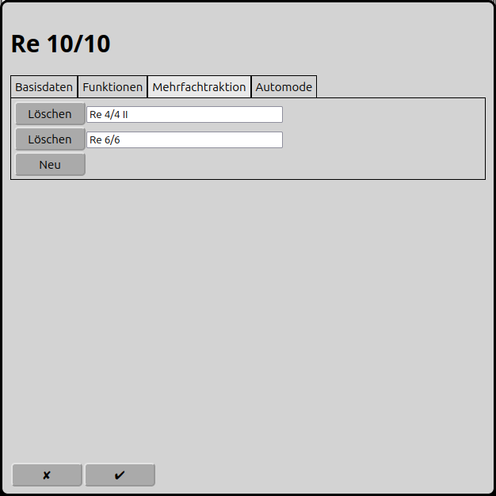
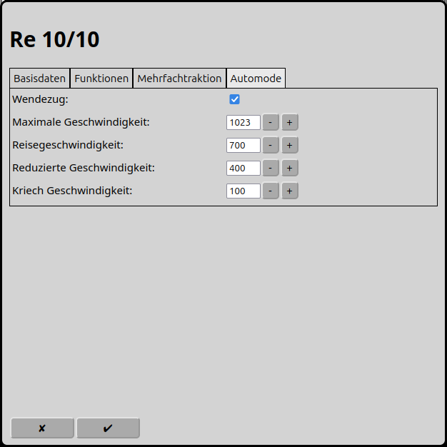

# Konfiguration der Mehrfachtraktionen
RailControl unterstützt Mehrfachtraktion. Dabei wird vorausgesetzt, dass die Lokomotiven bei gleicher Fahrstufe gleich schnell fahren. Auch sollten nur Lokomotiven mit einem Protokoll mit absoluter Fahrtrichtung und gleich vielen Fahrstufen verwendet werden. Märklin Motorola 1 unterstützt die absolute Fahrtrichtung nicht.

Im Hauptbildschirm kann man über das Icon  zur Konfiguration der Mehrfachtraktionen gelangen. Alternativ kann bei der ausgewählten Mehrfachtraktion das Icon  gewählt werden.

## Basisdaten

### Name
Der Name einer Lokomotive ist eine eindeutige Identifikation. Derselbe Name kann nur ein Mal vergeben werden. Einige Zentralen verwenden den Namen auch als eindeutige Identifikation zur Synchronisation der Lokomotiv-Datenbank (z.B. Märklin CS2/CS3).

### Zuglänge
Die Länge des Zuges, vorzugsweise in cm. Dies wird im automatischen Betrieb verwendet um zu entscheiden, ob ein Zug eine Fahrstrasse oder ein Zielgleis benutzen darf.

### Zugtyp
Der Typ des Zuges. Dies wird im automatischen Betrieb verwendet um zu entscheiden, ob ein Zug eine Fahrstrasse benutzen darf.

## Funkionen

Je nach Decoder können einer Lokomotive bis zu 32 Funktionen zugeordnet werden. Gezählt wird immer ab null. Die geschalteten Funktionen werden an alle zur Mehrfachtraktion gehörenden Lokomotiven weitergeleitet.

### Typ
RailControl kennt zwei Funktionstypen: die Dauerfunktion und die Momentfunktion.

Die Dauerfunktion kann mit einem Klick eingeschaltet werden und mit einem zweiten Klick wieder ausgeschaltet werden. Für Licht, Fahrgeräusch, Rangiergang und weitere langandauernde Aktionen sollte dies gewählt werden.

Die Momentfunktion ist für die Dauer des Klicks aktiv. Dies ist für kurze Aktionen wie Horn, Entkuppeln, Sprachansagen oder Kransteuerung sinnvoll.

### Symbol
In RailControl stehen diverse Symbole zur Auswahl.

## Mehrfachtraktion

Einer Mehrfachtraktion können mehrere andere Lokomotiven zugeordnet werden, welche sich danach identisch verhalten.

## Automatikbetrieb

### Wendezug
Wenn der Zug in beide Richtungen fahren kann ist dies ein Wende- oder Pendelzug. Im Automatikbetrieb kann RailControl die Fahrtrichtung eines Wendezuges wechseln. Ist Wendezug nicht angewählt, so lässt RailControl den Zug nur in der Ursprünglichen Fahrtrichtung weiterfahren.

### Maximale Geschwindigkeit
Die maximale Geschwindigkeit des Zuges kann hier eingestellt werden. Diese gilt dann auch für den manuellen Betrieb, jedoch nicht wenn die Geschwindigkeit von der Zentrale aus schneller gestellt wird.

### Reisegeschwindigkeit
Dies ist die Geschwindigkeit, mit der im Automatikbetrieb üblicherweise gefahren wird.

### Reduzierte Geschwindigkeit
Die reduzierte Geschwindigkeit wird eingestellt, wenn im Automatikbetrieb der erste Rückmelder der Fahrstrasse erreicht wird.

### Kriechgeschwindigkeit
Die Kriechgeschwindigkeit wird im Automatikbetrieb eingestellt, wenn der zweite Rückmelder der Fahrstrasse erreicht wird.

