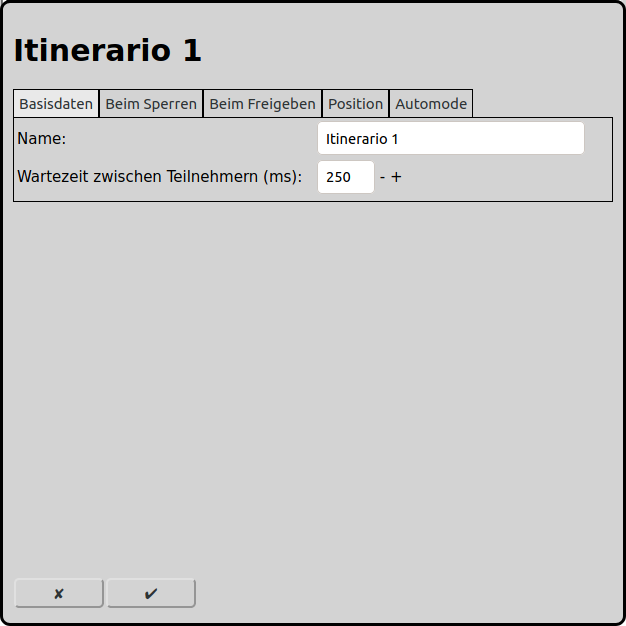
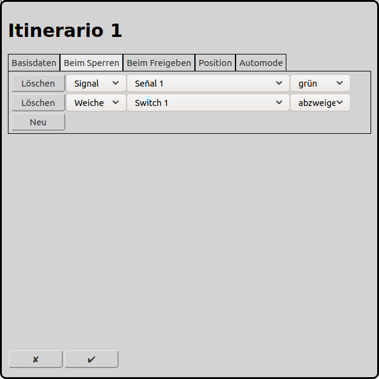
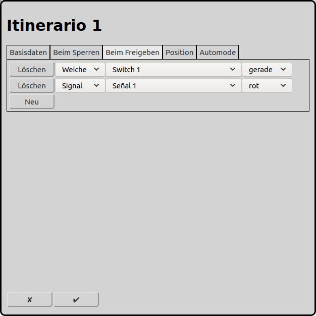
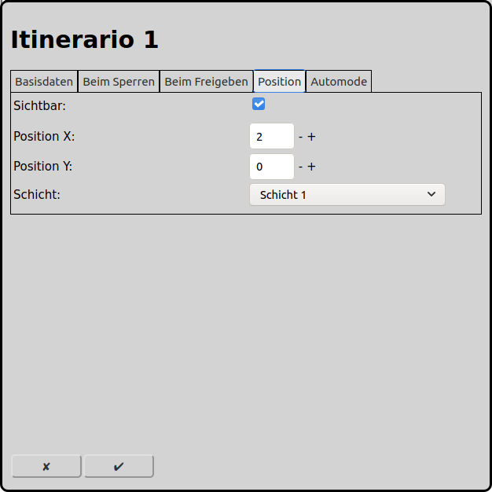
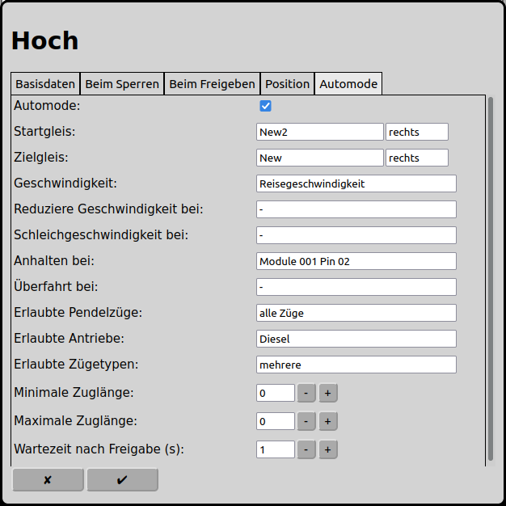

# Konfiguration der Fahrstraßen
Im Hauptbildschirm kann man über das Icon  zur Konfiguration der Fahrstrassen gelangen.

## Grundlagen
### Manueller Betrieb
Im manuellen Betrieb können Fahrstrassen dazu verwendet werden mehrere Elemente mit einem Klick zu schalten. Die zu schaltenden Elemente können Weichen, Signale und Zubehörartikel sein.

### Automatischer Betrieb
Im automatischen Betrieb sind Fahrstrassen ein zentrales Element. Züge fahren immer von einem Startgleis zu einem Zielgleis. Alle Elemente dazwischen (Weichen, Signale, Gleise und Zubehörartikel) müssen dabei auch eingetragen werden (Lasche "Beim Sperren"), damit diese für diesen Zug reserviert wird und von anderen Zügen nicht mehr verwendet werden kann. Wenn der Zug das Zielgleis erreicht hat werden das Startgleis und alle Elemente dazwischen wieder fregegeben und können von da an von einem anderen Zug beansprucht werden.

Im automatischen Betrieb ist es auch möglich Elemente zu schalten, wenn der Zug das Zielgleis erreicht hat (Lasche "Beim Freigeben").

## Basisdaten

### Name
Jede Fahrstrasse benötigt einen eindeutigen Namen. Wird kein eindeutiger Name vergeben, so wird ein eindeutiger Name gewählt oder der Name wird mit einer Nummer ergänzt um ihn eindeutig zu machen.

### Wartezeit zwischen den Teilnehmern
Die in den Laschen "Beim Sperren" und "Beim Freigeben" eingetragenen Elemente dürfen nicht alle gleichzeitig geschaltet werden. Die Zeit sollte so gewählt werden, dass eine einzelne Weiche umgelaufen ist, bevor die nächste Weiche geschaltet wird, damit immer nur eine Weiche gleichzeitig Strom verbraucht. Bei Magnetartikeln kann die Zeit relativ kurz gewählt werden (ca. 100ms), bei motorischen Weichenantrieben oder Servos sollte die Umlaufzeit dieser berücksichtigt werden (je nach Modell und Decoder-Einstellung bis ca. 1s).

## Beim Sperren

Hier können Weichen, Signale, Zubehörartikel, Gleise, Lokfunktionen, Fahrtrichtung der Lok, weitere Fahrstrassen, Pausen und Booster hinzugefügt werden.

Im manuellen Betrieb, wenn die Fahrstrasse mit einem Mausklick ausgelöst wird, werden Weichen, Signale und Zubehörartikel gemäss dem angegebenen Status ausgelöst. Auf die eingetragenen Gleise und Lokfunktionen hat eine manuelle Auslösung keinen Einfluss.

Im automatischen Betrieb, wenn die Fahrstrasse von der Lokomotive selbst ausgelöst wird, werden alle Elemente reserviert. Ab dann können die Elemente weder von einer anderen Fahrstrasse beansprucht werden, noch manuell gestellt werden. Anschliessend werden die Elemente entsprechend dem angegebenen Status gestellt. Wenn die Lokomotive das Zielgleis erreicht hat, werden die Elemente wieder freigegeben und können ab dann wieder von anderen Fahrstrassen beansprucht und manuell geschaltet werden.

## Beim Freigeben

Hier können Weichen, Signale, Zubehörartikel, Gleise, Lokfunktionen, Fahrtrichtung der Lok, weitere Fahrstrassen, Pausen und Booster hinzugefügt werden.

**Im manuellen Betrieb, wenn die Fahrstrasse mit einem Mausklick ausgelöst wird, werden die eingetragenen Elemente nicht berücksichtigt.**

Im automatischen Betrieb, wenn die Fahrstrasse von der Lokomotive selbst ausgelöst wird und die Lokomotive das Zielgleis erreicht hat, werden alle eingetragenen Elemente entsprechend ihrem Status geschaltet. Zu beachten ist, dass die beim einlaufen der Fahrstrasse reservierten Elemente automatisch wieder freigegeben werden. Damit bleibt die Liste üblicherweise leer.

## Position

### Sichtbar
Eine Fahrstrasse kann auf dem Gleisbildstellpult angezeigt werden oder eben nicht. Fahrstrassen die ausschliesslich für den automatischen Betrieb benötigt werden, können deshalb ausgeblendet werden. Nur Fahrstrassen die manuell ausgelöst werden sollten sichtbar sein.

Wenn die Fahrstrasse nicht sichtbar sein soll, werden die folgenden Eingabefelder ausgeblendet.

### Position X
Die Position des Elements in Quadraten ab dem linken Rand des Gleisbildes. Es wird bei null angefangen zu zählen.

### Position Y
Die Position des Elements in Quadraten ab dem oberen Rand des Gleisbildes. Es wird bei null angefangen zu zählen.

### Schicht
Die Schicht auf der das Element sichtbar sein soll.

## Automode

### Automode
Wenn die Fahrstrasse im automatischen Betrieb eingesetzt werden soll, dann kann dies hier ausgewählt werden.

Wenn die Fahrstrasse nur im manuellen Betrieb eingesetzt werden soll, werden die folgenden Eingabefelder ausgeblendet.

### Startgleis
Ein Zug fährt immer von einem Startgleis aus, welches hier angegeben werden muss. Ebenso muss die Fahrtrichtung angegeben werden in welcher der Zug das Startgleis verlässt.

### Zielgleis
Ein Zug fährt immer bis zum Zielgleis, welches hier angegeben werden muss. Ebenso muss die Fahrtrichtung angegeben werden in welcher der Zug das Zielgleis erreicht.

### Geschwindigkeit
Die Geschwindigkeit, mit der der Zug die Fahrstrasse befahren soll. So kann z.B. mit reduzierter Geschwindigkeit über ablenkende Weichen gefahren werden.

### Reduziere Geschwindigkeit bei
Wenn dieser Rückmelder erreicht wird, reduziert RailControl die Geschwindigkeit der Lokomotive, sofern nicht eine nachfolgende Fahrstrasse bereits eingestellt ist. Dieser Rückmelder ist fakultativ.

### Schleichgeschwindigkeit bei
Wenn dieser Rückmelder erreicht wird, reduziert RailControl die Geschwindigkeit der Lokomotive auf die Schleichgeschwindigkeit, sofern nicht eine nachfolgende Fahrstrasse bereits eingestellt ist. Dieser Rückmelder ist fakultativ.

### Anhalten bei
Wenn dieser Rückmelder erreicht wird, stoppt RailControl die Lokomotive, sofern nicht eine nachfolgende Fahrstrasse bereits eingestellt ist.

### Überfahrt bei
Wenn dieser Rückmelder erreicht wird, stellt RailControl den Strom ab, sofern nicht eine nachfolgende Fahrstrasse bereits eingestellt ist. Dieser Rückmelder ist als zusätzlicher Schutz gedacht, dass ein Zug nicht versehentlich zu weit fährt. Dieser Rückmelder ist fakultativ.

### Erlaubte Pendelzüge
Alle Züge: Alle Züge können diese Fahrstrasse benutzen.

Keine Wendezüge: Wendezüge dürfen diese Fahrstrasse nicht benutzen.

Nur Wendezüge: Wendezüge können diese Fahrstrasse benutzen.

### Erlaubte Antriebe
Damit können gewisse Fahrten ausgeschlossen werden, wie zum Beispiel, dass Elektrolokomotiven nicht auf nicht elektrifizierten Strecken verkehren und Dampflokomotiven nicht auf die U-Bahn-Gleise geleitet werden.

### Erlaubte Zugtypen
Damit können Einschränkungen gemacht werden, welche Zugtypen auf welchen Fahrstrassen verkehren dürfen. Zum Beispiel sollten Personenzüge in den Personenbahnhof einfahren und Güterzüge in den Güterbahnhof geleitet werden.

### Minimale Zuglänge
Die minimale Zuglänge, damit ein Zug diese Fahrstrasse benutzen darf. Die Zuglänge kann bei der Lokomotive eingestellt werden.

### Maximale Zuglänge
Die maximale Zuglänge, damit ein Zug diese Fahrstrasse benutzen darf. Die Zuglänge kann bei der Lokomotive eingestellt werden.

### Wartezeit nach Freigabe (s)
Nachdem der Zug das Zielgleis erreicht hat, kann eine Wartezeit in Sekunden erzwungen werden. Wird 0 eingetragen, so muss der Zug nicht warten und kann direkt die nächste Fahrstrasse befahren.

