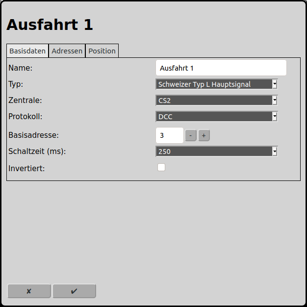
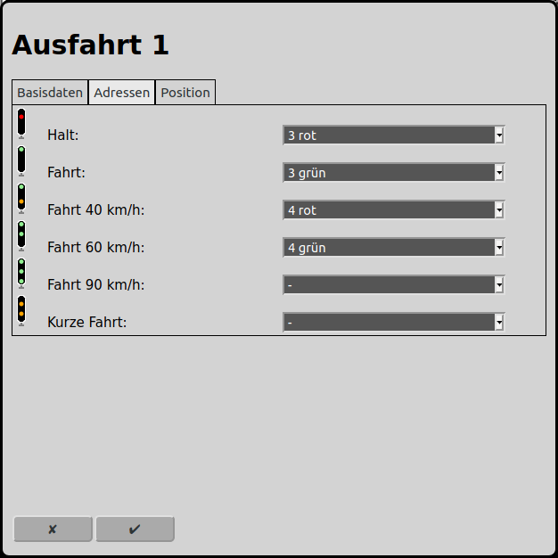
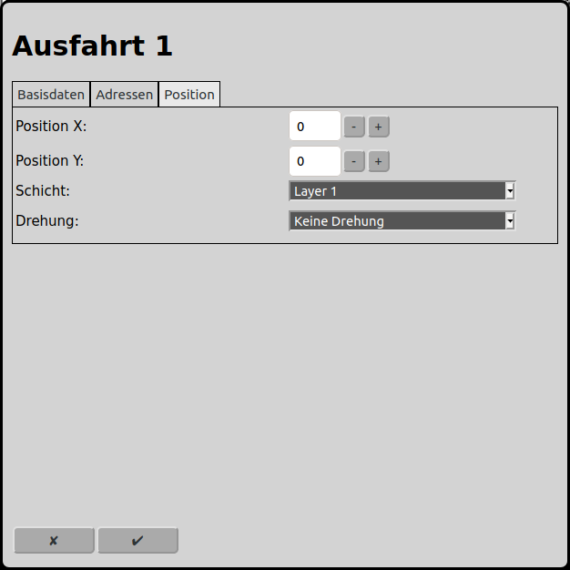

# Konfiguration der Signale
Im Hauptbildschirm kann man über das Icon  zur Konfiguration der Signale gelangen.

## Basisdaten

### Name
Jedes Signal benötigt einen eindeutigen Namen. Wird kein eindeutiger Name vergeben, so wird ein eindeutiger Name gewählt oder der Name wird mit einer Nummer ergänzt um ihn eindeutig zu machen.

### Ausrichtung
Obsolet. Wird nur noch angezeigt, wenn das Signal als Start oder Ziel konfiguriert war. Wird in künftigen Versionen ganz entfernt werden.

Bitte dieses Signal in der Fahrstrasse mit einem Gleis ersetzen und dieses Signal dem Gleis assoziieren.

### Typ
RailControl kennt folgende Signaltypen (weitere Signaltypen sind in Planung):

Einfach links: Dieses Signal kennt lediglich die beiden Fahrbegriffe "Halt" und "Fahrt". Es ist links vom Gleis angeordnet.

Einfach rechts: Dieses Signal kennt lediglich die beiden Fahrbegriffe "Halt" und "Fahrt". Es ist rechts vom Gleis angeordnet.

Schweizer Zwergsignal: Das Schweizer Zwergsignal kennt die Fahrbegriffe "Halt", "Fahrt" und "Vorsicht". Siehe auch: [Schweizer Zwergsignal](https://de.wikipedia.org/wiki/Zwergsignal)

Schweizer L Hauptsignal: Das Schweizer L Hauptsignal kennt die Fahrbegriffe "Halt", "Fahrt", "40 km/h", "60 km/h", "90 km/h" y "Kurze Fahrt". Siehe auch: [Schweizer Signalsystem L](https://de.wikipedia.org/wiki/Signalsystem_L)

Deutsches Ks: Das Deutsche Ks kennt die Fahrbegriffe "Halt", "Fahrt", "Rangieren", "Vorsicht", "dunkel" und "Halt erwarten". Siehe auch: [Deutsches Signalsystem Ks](https://de.wikipedia.org/wiki/Ks-Signalsystem)

### Länge
Obsolet. Wird nur noch angezeigt, wenn das Signal als Start oder Ziel konfiguriert war. Wird in künftigen Versionen ganz entfernt werden.

Bitte dieses Signal in der Fahrstrasse mit einem Gleis ersetzen und dieses Signal dem Gleis assoziieren.

### Zentrale
Sind mehrere Zentralen an RailControl konfiguriert, so muss die Zentrale ausgewählt werden, mit der das Signal geschaltet werden soll. Ist nur eine Zentrale konfiguriert so wird das Auswahlfeld nicht angezeigt.

### Protokoll
Unterstützt eine Zentrale mehr als ein Digital-Protokoll, so muss das Protokoll ausgewählt werden, mit der das Signal geschaltet werden soll. Unterstützt die Zentrale nur ein Protokoll, so wird das Auswahlfeld nicht angezeigt.

### Basisadresse
Die Digital-Basisadresse, mit der das Signal geschaltet werden soll. Unter "Adressen" können die Adressen der einzelnen Fahrbegriffe genau angegeben werden. Die Basisadresse ist jedoch die tiefste Adresse, die dort angegeben werden kann.

### Schaltzeit (ms)
Alle Magnetartikel müssen nach dem eigentlichen Schaltvorgang wieder ausgeschaltet werden. Bei neueren Magnetartikeln reichen dazu 100ms, ältere und trägere Magnetartikel erfordern manchmal 250ms. Manche Zentralen schalten selbständig mit einem dort konfigurierten Wert wieder aus, dann kann hier 0ms angegeben werden. Je nach verwendetem Weichenantriebstyp bzw. Weichendecoder kann auf den Ausschaltvorgang verzichtet werden. Dies betrifft insbesondere viele Servo- und Motorweichenantriebe und den entsprechenden Decodern.

### Invertiert
Wenn die Signalanschlüsse am Decoder vertauscht angeschlossen sind können die Anschlüsse in RailControl virtuell zurückgetauscht werden.

## Adressen

Je nach ausgewähltem Signaltype unter "Basisdaten" werden hier die möglichen Fahrbegriffe des Signals angezeigt. Für jeden möglichen Fahrbegriff kann eine Adresse ausgewählt werden, basierend auf der Basisadresse unter . Als Standard werden die Adressen aufsteigend vergeben.

## Position

### Position X
Die Position des Element in Quadraten ab dem linken Rand des Gleisbildes. Es wird bei null angefangen zu zählen. Ist ein Element grösser als ein Quadrat ist das Quadrat oben links relevant für die Zählung.

### Position Y
Die Position des Element in Quadraten ab dem oberen Rand des Gleisbildes. Es wird bei null angefangen zu zählen. Ist ein Element grösser als ein Quadrat ist das Quadrat oben links relevant für die Zählung.

### Schicht
Die Schicht auf der das Element sichtbar sein soll.

### Drehung
Die Elemente können jeweils in 90 Grad Schritten gedreht werden.

## Rückmelder
Obsolet. Wird nur noch angezeigt, wenn schon Rückmelder konfiguriert waren. Wird in künftigen Versionen ganz entfernt werden.

Bitte dieses Signal in der Fahrstrasse mit einem Gleis ersetzen und dieses Signal dem Gleis assoziieren.

## Automode
Obsolet. Wird nur noch angezeigt, wenn das Signal als Start oder Ziel konfiguriert war. Wird in künftigen Versionen ganz entfernt werden.

Bitte dieses Signal in der Fahrstrasse mit einem Gleis ersetzen und dieses Signal dem Gleis assoziieren.

