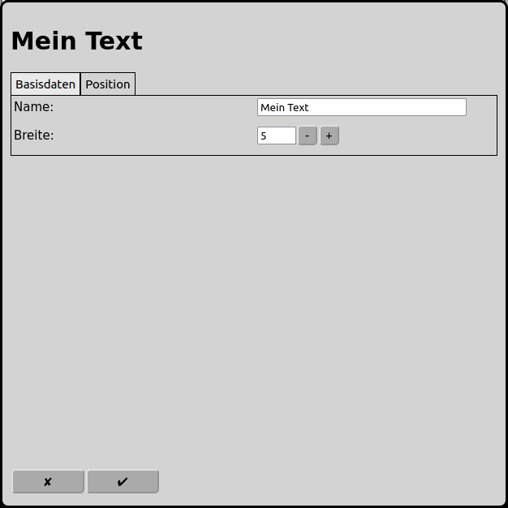
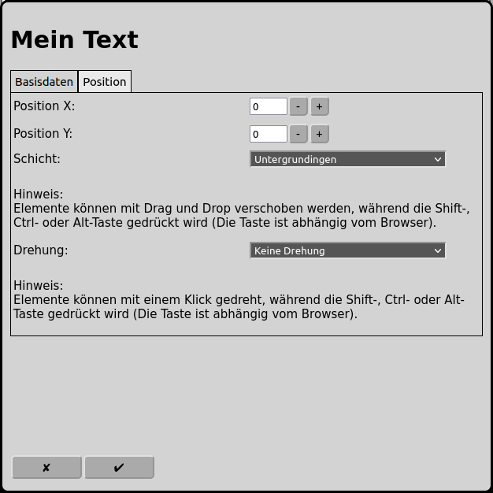

# Konfiguration der Texte
Im Hauptbildschirm kann man über das Icon  zur Konfiguration der Texte gelangen.

## Basisdaten

### Name
Der Name ist auch gleichzeitig der Text, der auf dem Gleisbild angeziegt wird.

Jeder Text benötigt einen eindeutigen Namen. Wird kein eindeutiger Name vergeben, so wird ein eindeutiger Name gewählt oder der Name wird mit einer Nummer ergänzt um ihn eindeutig zu machen.

### Breite
Der Text wird in der Breite begrenzt. Die Begrenzung wird hier eingestellt.

## Position

### Position X
Die Position des Element in Quadraten ab dem linken Rand des Gleisbildes. Es wird bei null angefangen zu zählen. Ist ein Element grösser als ein Quadrat ist das Quadrat oben links relevant für die Zählung.

### Position Y
Die Position des Element in Quadraten ab dem oberen Rand des Gleisbildes. Es wird bei null angefangen zu zählen. Ist ein Element grösser als ein Quadrat ist das Quadrat oben links relevant für die Zählung.

### Schicht
Die Schicht auf der das Element sichtbar sein soll.

### Drehung
Die Elemente können jeweils in 90 Grad Schritten gedreht werden.

