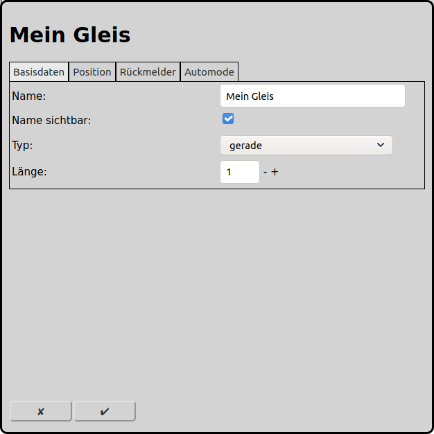
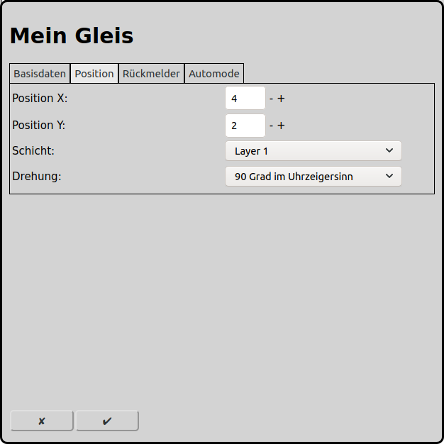
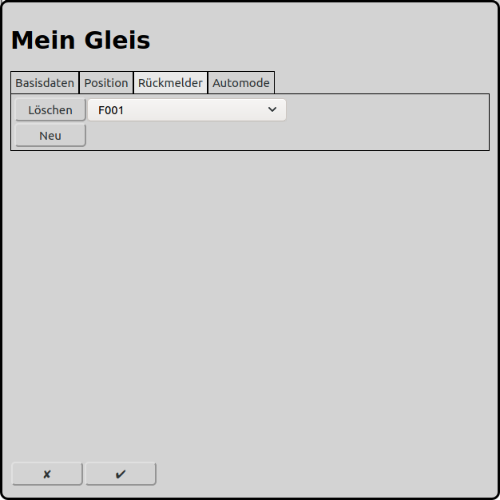
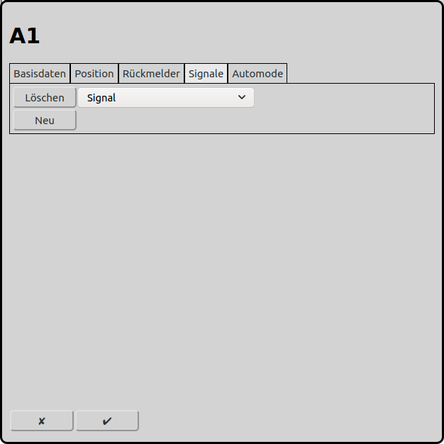
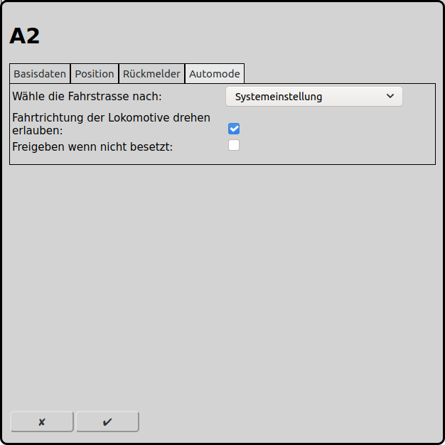

# Konfiguration der Gleise
Im Hauptbildschirm kann man über das Icon  zur Konfiguration der Gleise gelangen.

Auf dem Gleisbild sind die Gleise ein zentrales Element. Damit kann der Gleisplan der Modelleisenbahn nachgebildet werden. Gleichzeitig sind die Gleise für den Automatikbetrieb sehr wichtig, denn die Fahrstrassen starten oder enden immer an einem Gleis oder Signal.

## Basisdaten

### Typ
RailControl kennt verschiedene Gleistypen. Je nach gewähltem Gleistyp können weitere Einstellungen gemacht werden.

Gerade: Ein simples gerades Gleisstück. Es wird empfohlen dieses Gleisstück als Start oder Ziel für Fahrstrassen zu verwenden. Grundsätzlich sind aber auch andere Gleistypen als Start oder Ziel möglich.

Gebogen: Ein Gleisstück, welches diagonal über das Gleisbild führt.

Ende / Prellbock: Symbolisiert ein Gleisende oder einen Prellbock.

Brücke: Symbolisiert eine Brücke.

Tunnel (zwei Seiten): Symbolisiert einen Tunnel. Dabei sind beide Tunnelportale in einem Element integriert. Die allfälligen leeren Quadrate im Gleisbild können nicht von anderen Elementen verwendet werden.

Tunnel (eine Seite): Symbolisiert ein Tunnelportal. Sinnvollerweise werden zwei derartige Symbole verwendet.

Link: Symbolisiert ein Gleis, das auf einer anderen Schicht weitergeführt wird.

Kreuzung links: Symbolisiert eine einfache Kreuzung ohne Weiche. Dabei ist je ein gerader und ein diagonaler Strang vorhanden.

Kreuzung rechts: Symbolisiert eine einfache Kreuzung ohne Weiche. Dabei ist je ein gerader und ein diagonaler Strang vorhanden.

Kreuzung symmetrisch: Symbolisiert eine einfache Kreuzung ohne Weiche. Dabei sind zwei diagonaler Stränge vorhanden.

### Hauptgleis
Insbesondere im Automatikbetrieb kann sich ein Gleisabschnitt/Block über mehrere physische Gleisstücke wie Brücken und Tunnel erstrecken. Dann ist es sinnvoll ein Hauptgleis zu definieren und die weiteren Gleise diesem anzuhängen. Ein solch angehängtes Gleis verhält sich identisch wie das Hauptgleis, hat also dieselben Kontextmenus und dieselbe Ausleuchtung wie das Hauptgleis.

### Name
Jedes Gleis benötigt einen eindeutigen Namen. Wird kein eindeutiger Name vergeben, so wird ein eindeutiger Name gewählt oder der Name wird mit einer Nummer ergänzt um ihn eindeutig zu machen.

### Name sichtbar
Bei geraden Gleisen kann gewählt werden, ob der Name des Gleisstückes angezeigt weden soll oder nicht. Wird das Gleis als Start oder Ziel einer Fahrstrasse benutzt, so ist die Anzeige des Gleises meist sinnvoll. Auf einer rein manuell gesteuerten Anlage wird oft auf die Anzeige der Gleisnamen verzichtet.

### Angezeigter Name
Dieser Text wird als Beschreibung in der Übersicht angezeigt. Der angezeigte Name muss nicht eindeutig sein. Wenn dieses Feld leer ist, dann wird der Text angeziegt, der als Name angegeben wurde.

### Länge
Bei einigen Gleistypen kann die Länge des Gleises gewählt werden. Entsprechend der angegebenen Zahl werden auf dem Gleisbild entsprechend Quadrate verwendet.

## Position

### Position X
Die Position des Elements in Quadraten ab dem linken Rand des Gleisbildes. Es wird bei null angefangen zu zählen. Ist ein Element grösser als ein Quadrat ist das Quadrat oben links relevant für die Zählung.

### Position Y
Die Position des Elements in Quadraten ab dem oberen Rand des Gleisbildes. Es wird bei null angefangen zu zählen. Ist ein Element grösser als ein Quadrat ist das Quadrat oben links relevant für die Zählung.

### Schicht
Die Schicht auf der das Element sichtbar sein soll.

### Drehung
Die Elemente können jeweils in 90 Grad Schritten gedreht werden.

## Rückmelder

Jedem Gleis können ein oder mehrere Rückmelder zugeordnet werden. Die zugeordneten Rückmelder geben die Belegung des Gleises wieder. Im Automatikbetrieb können bei einer Fahrstrasse als Ziel nur diejenigen Rückmelder ausgewählt werden, die dem Zielgleis zugeordnet sind.

## Signale

Einem Gleis können ein oder mehrere Signale zugeordnet werden. Zugeordnete Signale werden beim Freigeben im Automode auf Halt gestellt, wenn die Fahrstrasse wieder freigegeben wird oder wenn unter Automode "Freigeben wenn nicht besetzt" angewäht wurde und das Gleis freigegeben wird (alle Rückmelder melden frei).

## Automode

### Wähle die Fahrstrasse nach
Im Automatikbetrieb muss RailControl bei mehreren möglichen Fahrstrassen eine auswählen. Dabei kann nach verschiedenen Konzepten vorgegangen werden. Fahrstrassen die aktuell in Benutzung sind werden nie gewählt.

Systemeinstellung: Es wird die Einstellung verwendet, die unter [Allgemeine Einstellungen](#allgemeine-einstellungen) gemacht wurde.

Egal: Die zu wählende Fahrstrasse ist egal. Es wird meistens dieselbe Fahrstrasse gewählt.

Zufall: Die Fahrstrasse wird aktiv nach Zufall gewählt.

Kürzestes Gleis: Es wird die Fahrstrasse mit dem kürzesten Ziel-Gleis gewählt.

Am längsten ungenutzt: Es wird die am längsten nicht genutzte Fahrstrasse gewählt.

### Fahrtrichtung der Lokomotive drehen erlauben
Hiermit kann einer Lokomotive erlaubt werden auf diesem Gleis zu wenden. Damit dies auch ausgeführt wird muss zusätzlich in die Gegenrichtung eine abgehende Fahrstrasse konfiguriert sein und der betreffende Zug muss als Wendezug konfiguriert sein.

Sinnvoll ist dies üblicherweise in einem Bahnhof, wo Pendelzüge wenden sollen. Auf offener Strecke wirkt dies eher verwirrend.

### Freigeben wenn nicht besetzt
Ein Gleis kann freigegeben werden, sobald kein zugeordneter Rückmelder mehr aktiv ist. Damit kann ein Startgleis bereits freigegeben werden, obwohl der Zug das Zielgleis noch nicht erreicht hat, aber das Startgleis schon komplett verlassen hat.
Diese Einstellung ist nur sinnvoll, wenn ein Gleis komplett überwacht ist mit Gleisbelegtmeldern, Achszählern oder einer allfälligen weiteren Variante, die ein zuverlässiges Freifahren des Gleises detektieren kann.

