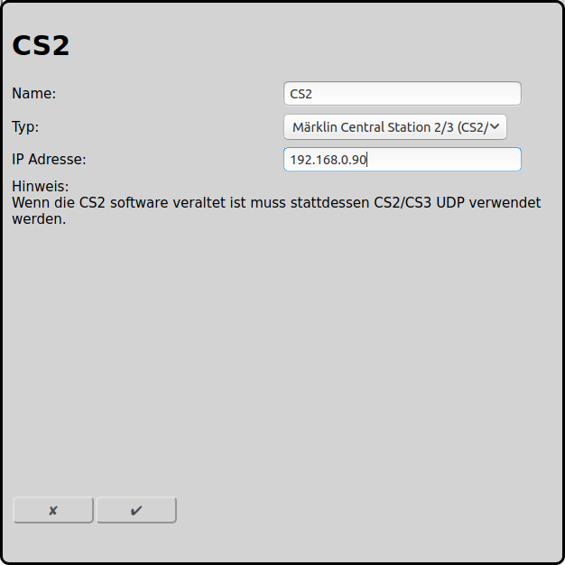

## Konfiguration der Märklin Central Station 2/3 (CS2/3) mit TCP (neu)

Die neue, von Märklin nicht dokumentierte Anbindung mit TCP einer CS2/CS3 an RailControl ist hier beschrieben.

Die alte und dokumentierte Variante der [Anbindung einer Central Station 2/3 ist mit UDP](#konfiguration-der-märklin-central-station-23-cs23-mit-udp-alt) und sollte nicht mehr verwendet werden.

### Konfiguration CS2/CS3

Bei Setup/Konfiguration (Schraubenschlüssel)/IP müssen zwingend die IP-Adresse und die Netzmaske eingetragen werden. Die Adresse die hier eingetragen wird muss anschliessend auch bei RailControl verwendet werden. IP-Gateway und DNS-Server sind für die Verwendung von RailControl nicht von Belang, diese werden nur für das CS2/CS3 Online-Update verwendet.

### Konfiguration RailControl

Der einzutragende Name ist ausschliesslich zur Wiedererkennung für den Benutzer. Vor allem bei mehreren Zentralen ist dies von Belang. Des weiteren muss lediglich die IP-Adresse der CS2/CS3 eingetragen werden:

### Konfiguration Firewall

Üblicherweise ist keine spezielle Konfiguration der Firewall nötig. Wenn, dann muss sichergestellt werden, dass Datenverkehr vom RailControl Server auf den TCP-Port 15731 der CS2/CS3 zugelassen ist.

