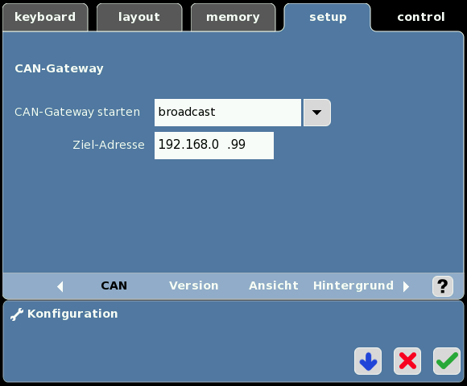
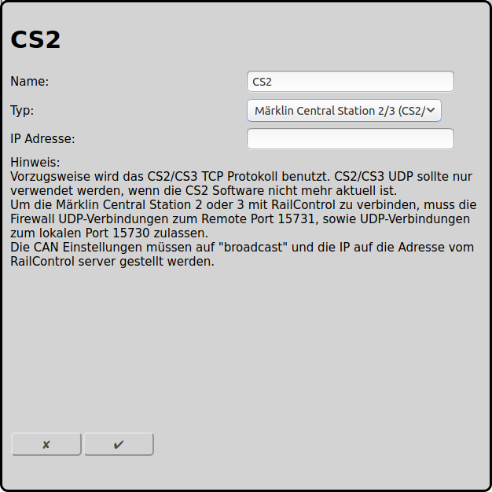

## Konfiguration der Märklin Central Station 2/3 (CS2/3) mit UDP (alt)

Die alte und dokumentierte Variante der Anbindung einer Central Station 2/3 ist mit UDP, wessen konfiguration hier beschrieben ist.

Es gibt eine neue, von Märklin nicht dokumentierte [Anbindung der Central Station 2/3 mit TCP](#konfiguration-der-märklin-central-station-23-cs23-mit-tcp-neu), welche dieser Anbindung vorzuziehen ist.

Damit RailControl mit der Central Station 2/3 von Märklin mit UDP sprechen kann muss diese entsprechend konfiguriert werden. Wir empfehlen dringend der CS2/CS3 eine feste IP-Adresse zu verteilen. Prinzipiell ist DHCP auch möglich aber etwas komplexer, entsprechend raten wir davon ab.

### Konfiguration CS2/CS3

Bei Setup/Konfiguration (Schraubenschlüssel)/IP müssen zwingend die IP-Adresse und die Netzmaske eingetragen werden. Die Adresse die hier eingetragen wird muss anschliessend auch bei RailControl verwendet werden. IP-Gateway und DNS-Server sind für die Verwendung von RailControl nicht von Belang, diese werden nur für das CS2/CS3 Online-Update verwendet.

Die CS2/CS3 muss auch wissen, wie RailControl erreichbar ist. Beim CAN-Gateway muss deshalb breadcast und die IP-Adresse des RailControl-Servers angegeben werden (In diesem Beispiel 192.168.0.99).

### Konfiguration RailControl

Der einzutragende Name ist ausschliesslich zur Wiedererkennung für den Benutzer. Vor allem bei mehreren Zentralen ist dies von Belang. Des weiteren muss lediglich die IP-Adresse der CS2 eingetragen werden:

### Konfiguration Firewall

Eine allfällige Firewall muss allen Datenverkehr vom RailControl Server auf den UDP-Port 15731 der CS2/CS3 zulassen. Ebenso muss sämtlicher Datenverkehr an RailControl auf dem UDP-Port 15730 zugelassen werden. Ersteres ist üblicherweise standardmässig erlaubt, letzteres muss immer explizit zugelassen werden. Wenn die Rechner nicht mit dem Internet verbunden sind, kann die Firewall der Einfachheit halber auch ganz ausgeschaltet werden.

