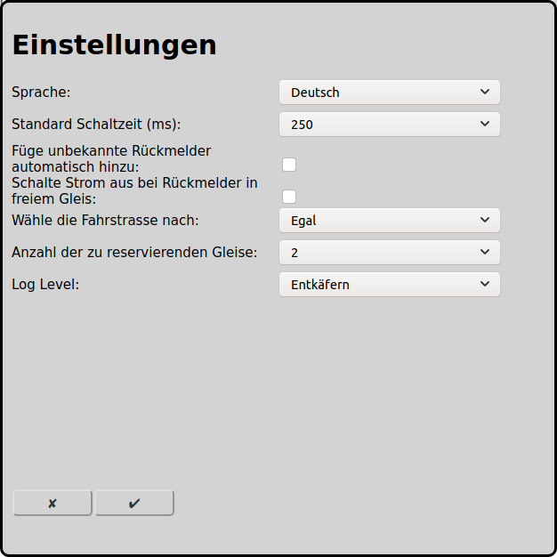

# Allgemeine Einstellungen
Für den Betrieb von RailControl sind einige wenige Einstellungen nötig, die das Verhalten von RailControl beeinflussen.

Im Hauptbildschirm kann man über das Icon  zur Konfiguration der Zentralen gelangen:

## Basisdaten
### Sprache
Es kann die Sprache eingestellt werden. Alle Texte werden in der eingestellten Sprache ausgegeben.

### Log Level
Der Level mit dem Aktionen aufgezeichnet werden.

Fehler: Es werden nur schwerwiegende Fehler aufgezeichnet.

Warnung: Es werden zusätzlich Warnungen aufgezeichnet, die eine ordentliche Ausführung von RailControl höchstwahrscheinlich verunmöglichen.

Informationen: Es werden alle wichtigen Aktionen aufgezeichnet. Diese Einstellung ist empfohlen.

Entkäfern: Es werden alle Aktionen aufgezeichnet. Insbesondere für die Fehlersuche ist diese Einstellung sinnvoll.

## Start
### Initialisierung der Lokomotiven
Beim Start von RailControl können die Lokomotiven initialisiert werden. Dabei wird bei allen Lokomotiven die Geschwindigkeit auf 0 gesetzt und die Funktionen auf die letzten bekannten Zustände gesetzt.

Keine Initialisierung: Die Lokomotiven werden beim Start von RailControl nicht initialisiert.

Nur Geschwindigkeit: Die Geschwindigkeit der Lokomotiven wird beim Start von RailControl auf 0 gesetzt.

Geschwindigkeit und Funktionen: Die Geschwindigkeit der Lokomotiven wird beim Start von RailControl auf 0 gesetzt und die Funktionen auf die letzten bekannten Zustände.

## Rückmelder
### Füge unbekannte Rückmelder automatisch hinzu
Die meisten Zentralen liefern die Information über betätigte [Rückmelder](#konfiguration-der-rückmelder) ohne dass diese in RailControl konfiguriert wurden. RailControl kann diese Information nutzen um die Rückmelder automatisch zu konfigurieren.

### Schalte Strom aus bei Rückmelder in freiem Gleis
Wenn diese Option gewählt ist schaltet RailControl den Strom aus und blockiert das Gleis wenn ein Rückmelder des Gleises betätigt wird, obwohl kein Zug in dem Gleis erwartet wird.

## Zubehörartikel
### Standard Schaltzeit (ms)
Die Magnetartikel müssen nach dem eigentlichen Schaltvorgang wieder ausgeschaltet werden. Bei neueren Magnetartikeln reichen dazu 100ms, ältere und trägere Magnetartikel erfordern machmal 250ms. Manche Zentralen schalten selbständig mit einem dort konfigurierten Wert wieder aus, dann kann hier 0ms angegeben werden.

### Schalte Zubehörartikel
wenn in falscher Lage: RailControl sendet ein Schaltkommando nur an die Zentrale, wenn der Zubehörartikel in der falschen Lage ist.

immer: RailControl sendet ein Schaltkommando immer an die Zentrale, unabhängig von der Lage des Zubehörartikels.

## Automode
### Wähle Fahrstraße nach
Im Automatikbetrieb muss RailControl bei mehreren möglichen Fahrstrassen eine auswählen. Dabei kann nach verschiedenen Konzepten vorgegangen werden. Fahrstrassen die aktuell in Benutzung sind werden nie gewählt.

Egal: Die zu wählende Fahrstrasse ist egal. Es wird meistens dieselbe Fahrstraße gewählt.

Zufall: Die Fahrstrasse wird aktiv nach Zufall gewählt.

Kürzestes Gleis: Es wird die Fahrstrasse mit dem kürzesten Ziel-Gleis gewählt.

Am längsten ungenutzt: Es wird die am längsten nicht genutzte Fahrstrasse gewählt.

### Anzahl der zu reservierenden Fahrstraßen
Die Anzahl der Fahrstraßen, die im Automatikbetrieb reserviert werden. Wenn nur eine Fahrstrasse reserviert wird, stoppt der Zug am Ende jeder Fahrstrasse.

