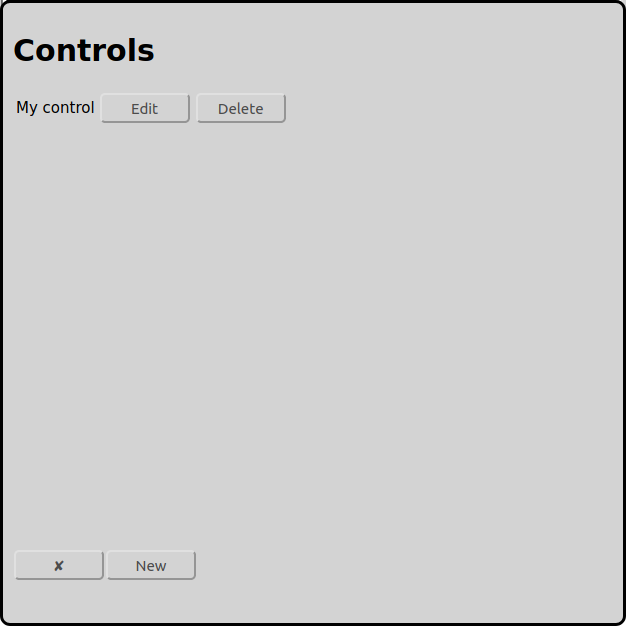

# Configuration of Controls
On the main screen one can open the configuration of the controls with the icon :

In the example above there is already a configured control with the name "My Control".

At the bottom there is a button named "New" to add a new control to the configuration.

Usually there is only one control per model railway layout. For bigger layouts it can make sense to use more then one control, so there is one control for the locomotives, one for the accessories and one for the feedbacks.

Actually RailControl supports the following controls:

* Arduino 	DCC-EX (formerly DCC++EX formerly DCC++)
* CAN-Digital-Bahn 	[CC-Schnitte 2.1](#configuration-of-cc-schnitte)
* Digikejis 	DR5000
* ESU 	ECoS/Central Station Reloaded
* Fleischmann 	[Twin-Center](#configuration-of-fleischmann-twin-center)
* LDT 	[HSI-88 RS232](#configuration-of-hsi-88-rs232)
* KM-1 	System Control 7
* Märklin 	[Central Station 2/3 with TCP (new)](#configuration-of-märklin-central-station-23-cs23-with-tcp-new)
* Märklin 	[Central Station 2/3 with UDP (old)](#configuration-of-märklin-central-station-23-cs23-with-udp-old)
* Märklin 	[Interface 6050/6051](#configuration-of-märklin-interface-60506051)
* OpenDCC 	[OpenDCC Z1](#configuration-of-opendcc-z1)
* Roco 	[Z21/z21](#configuration-of-roco-z21)
* Tams 	[MasterControl](#configuration-of-tams-mastercontrol)
* Tams 	[MasterControl 2](#configuration-of-tams-mastercontrol-2)
* Tams 	[RedBox](#configuration-of-tams-redbox)
* Uhlenbrock 	Adapter 63120
* Uhlenbrock 	Adapter 63820
* Uhlenbrock 	[Intellibox](#configuration-of-uhlenbrock-intellibox)
* Uhlenbrock 	Intellibox II

