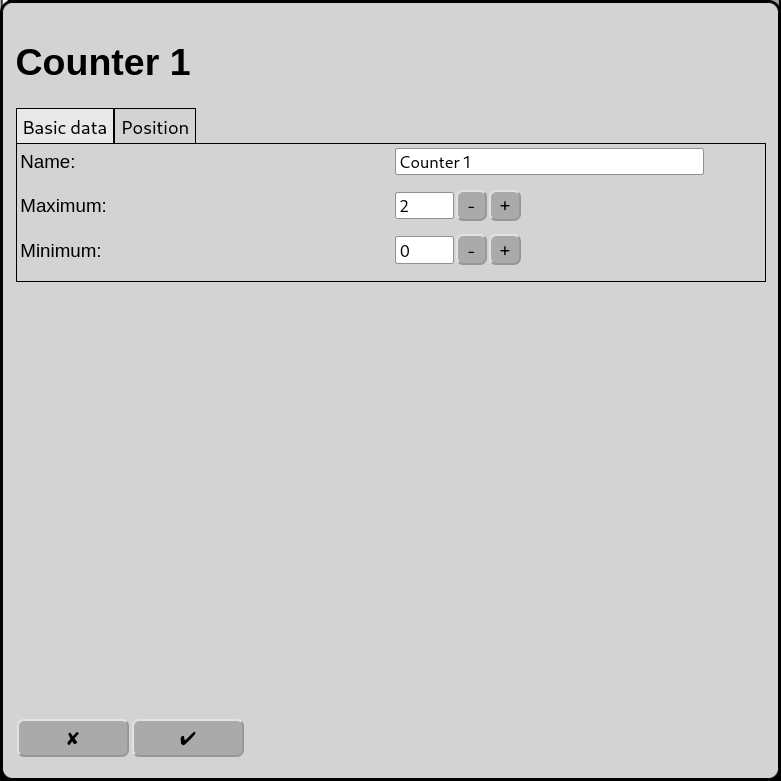
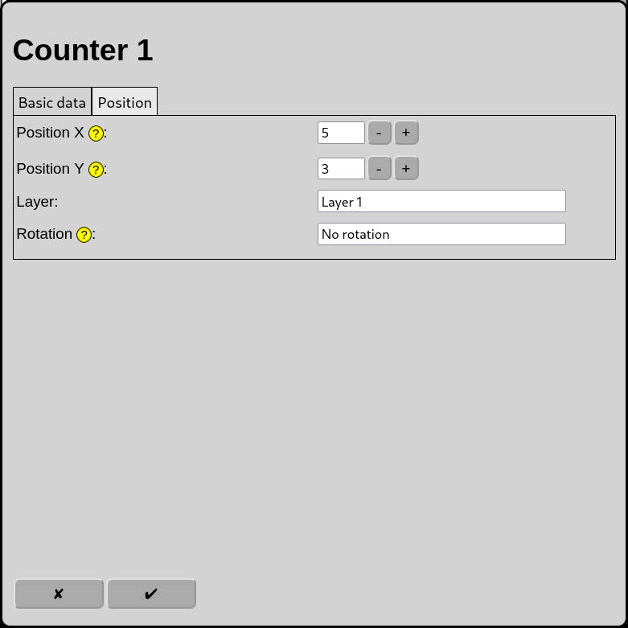

# Configuration of Counters
On the main screen open the configuration of counters with the icon .

Counters are used in automatic operation to limit the number of reserved routes in a track network, in case the routes could deadlock each other.

During the reservation of a route, Counters are either
* incremented and decremented during the release or
* decremented and incremented during the release
by 1.

One Route can influence none or an arbitrary number of Counters. For each Counter the user configures a Maximum value and a Minimum value.

When a Counter has reached its Maximum, respectively Minimum value, a Route gets blocked during its reservation until it is possible to increment, respectivelyu decremend, the value of the Counter.

## Basic data

### Name
Every Counter requires a unique name. If there is no name RailControl chooses a name for you and if the name is not unique it will be suffixed with a number to make it unique.

### Maximum
The highest value the Counter may reach. Once the Maximum is reached, the reservation of a Route is blocked which tries to further increment the Counter. The range of value is positive including zero.

### Minimum
The lowest value the Counter may reach. Once the Minimum is reached, the reservation of a Route is blocked which tries to further decrement the Counter. The range of value is negative including zero. 

## Position

Counters are shown in the overview as a straight track with the current counter value next to it.

### Position X
The position of the counter in squares from the left of the track diagram. Counting starts at zero.

### Position Y
The position of the counter in squares from the top of the track diagram. Counting starts at zero.

### Layer
The layer the element should be visible on.

### Rotation
The Counter track can be rotated in steps of 90 degrees.

