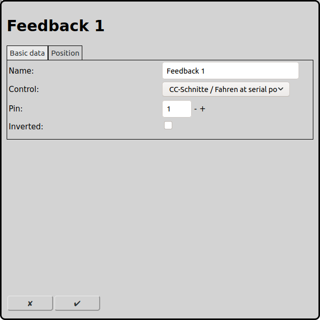
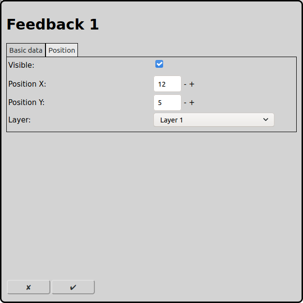

# Configuration of Feedbacks
On the main screen the configuration of the feedbacks can be opened with the icon .

Feedbacks are needed in automatic operation to detect the position of the trains so RailControl can stop them when they reached its destination track.

## Basic data

### Name
Every feedback requires a unique name. If there is no name RailControl chooses a name for you and if the name is not unique it will be prefixed with a number to make it unique.

### Control
If more than one control that can handle feedbacks is configured by RailControl, the control that has attached the physical feedback has to be selected. Otherwise the selection is not shown at all. If there is only one control configured the field is not visible.

### Pin
The number that the control knows the physical pin with. Most controls count the pins continuously starting from 1. Some controls have a complex algorithm to calulate the number of the pin. Please consult the documentation of the control and/or of the feedback.

If it is not clear which physical pin has which number, navigate to [general settings](#general-settings) and turn on "Automatically add unknown feedbacks". Then RailControl will add physically used feedbacks automatically. Then the feedback will be visible in the feedback layer of the control.

### Inverted
The logic of the feedbacks can be inverted. Usually a closed feedback is recognized as active. If an open feedback represents an occupied track the logic must be inverted.

## Position

### Visible
A feedback can be visible on the track layout or not. If a feedback is acosiated to a track the cumulated state of al feedbacks of that track will be show as color of that track. Therefor a separate display of the status of the feedbach usually does not make sence.

Never the less a feedback will always be shown on the feedback layer of the control.

If the visibility of a feedback is turned off the following fields are not shown.

### Position X
The position of the element in squares from the left of the track diagram. Counting starts at zero.

### Position Y
The position of the element in squares from the top of the track diagram. Counting starts at zero.

### Layer
The layer the element should be visible on.

