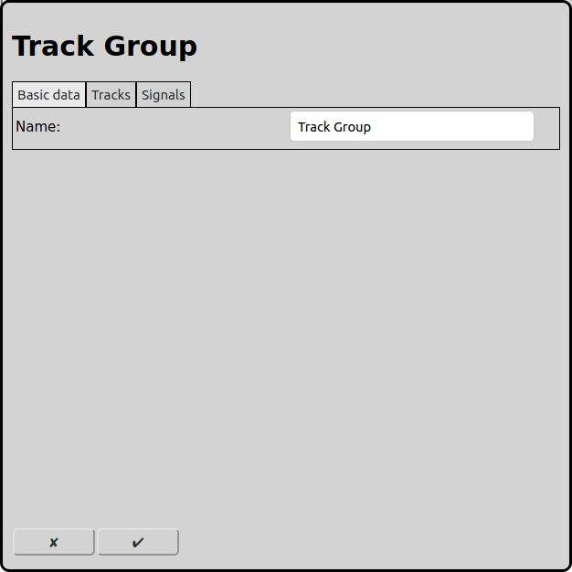
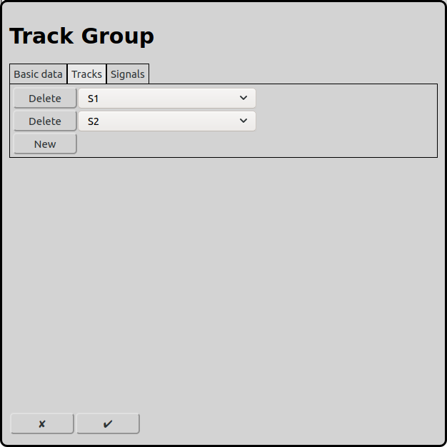

# Configuration of Trackgroups
On the main screen the configuration of the trackgroups can be opened with the icon .

Trackgroups only have an effect in automatoc operation. All tracks of a trackgroup can only be entered from one side. Therefore it is not possible that two trains enter a single line from both sides. But it is possible that two trains can follow each other on the same line.

## Basis data

### Name
Every trackgroup requires a unique name. If there is no name RailControl chooses a name for you and if the name is not unique it will be prefixed with a number to make it unique.

## Tracks

The tracks that shall only be used in one direction can be selected here.

### Signals
Obsolete. Is only shown if there are already signals configured. Will be removed in future versions.

