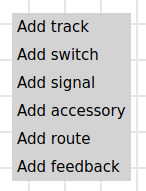

# Configuration of Layers
On the main screen one can open the configuration of the layers with the icon . There one can add, configure and delete several layers, which then can be selected in the layout.

On the right half of the screen it is possible to configure and display the layout of the model railway. Therefore one can add, configure and operate tracks, switches, signals and feedbacks. For larger layouts it is possible to add and select more than one layer.

With a right mouse click on an empty area on the layout one can add additional elements at this place:

