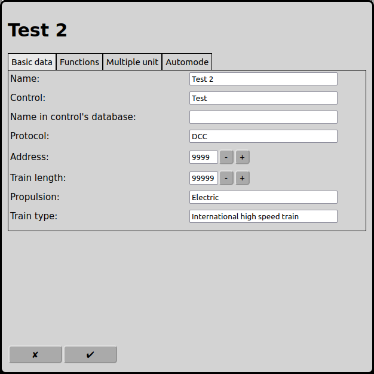
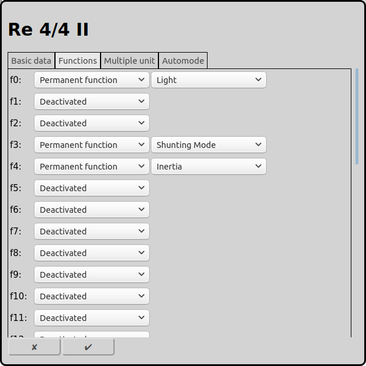
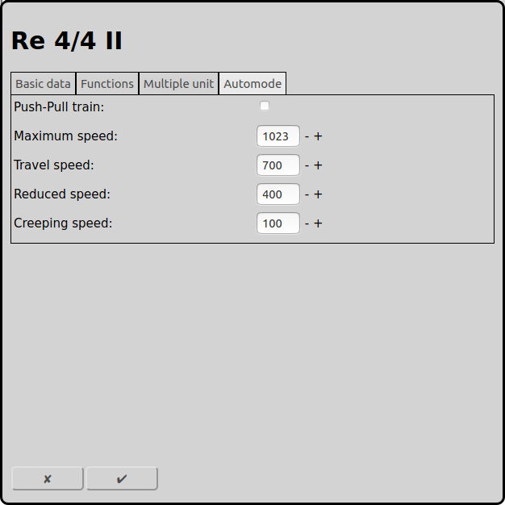

# Configuration of Locomotives
Each locomotive on a railway layout has to be configured correctly to be controled by RailControl.

On the main screen one can open the configuration of the setting with the icon . Alternatively at the selected locomotive one can use the icon  to get directly to the settings of that locomotive.

## Basics

### Name
The Name of the locomotive.

### Control
If more than one control is configured by RailControl, the control that controls the locomotive has to be selected. Otherwise the selection is not shown at all.

### Protocol
If the control supports more than one digital protocol, the protocol that is used by de locomotive has to be selected.

### Address
The digital address that is used by de locomotive has to be entered.

### Train Length
The length of the train in cm. This is used for the automatic operation to decide if a train can enter a route or a destination track.

### Propulsion
The propulsion of the train. This is used for the automatic operation to decide if a train can enter a route.

### Train type
The type of the train. This is used for the automatic operation to decide if a train can enter a route.

## Functions

Depending of the decoder there can be assigned up to 32 functions to a locomotive. The counting starts always at zero.

### Type
RailControl knows two different function types: Permanent function and moment function.

The permanent function can be turned on with one click and can be turned off again with a second click. For lights, running noise, shunting mode and other actions with a long duration this should be selected.

The moment function is activ while pressing the mouse only. This can be used for short actions like horns, uncoupling, voice announcements or a crane controls.

### Symbol
RailControl offers to select one of many symbols on the button.

## Automode

### Push-Pull train
A push-pull train can run in both directions. In automode RailControl can change the running direction of a push-pull train. If push-pull train is not selected, RailControl will only try to continue the journey of the train in the same running direction.

### Maximum speed
The maximum speed of the train can entered here. This is important for manual operation. The setting here does not have an effect if the speed is set at the control.Betrieb, jedoch nicht wenn die Geschwindigkeit von der Zentrale aus schneller gestellt wird.

### Travel speed
This speed is used by RailControl for normal operation in automode.

### Reduced speed
The reduced speed is used by RailControl in automode if the first feedback of the route is reached.

### Creeping speed
The creeping speed is used by RailControl in automode if the second feedback of the route is reached.

