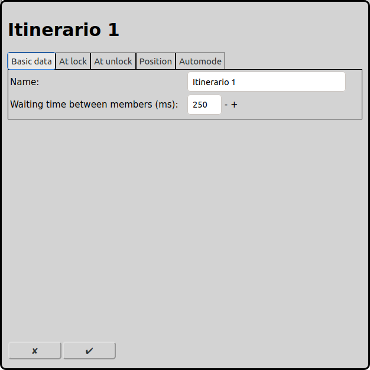
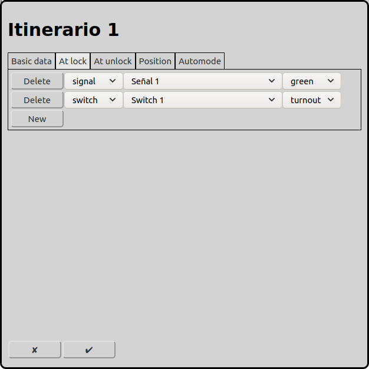
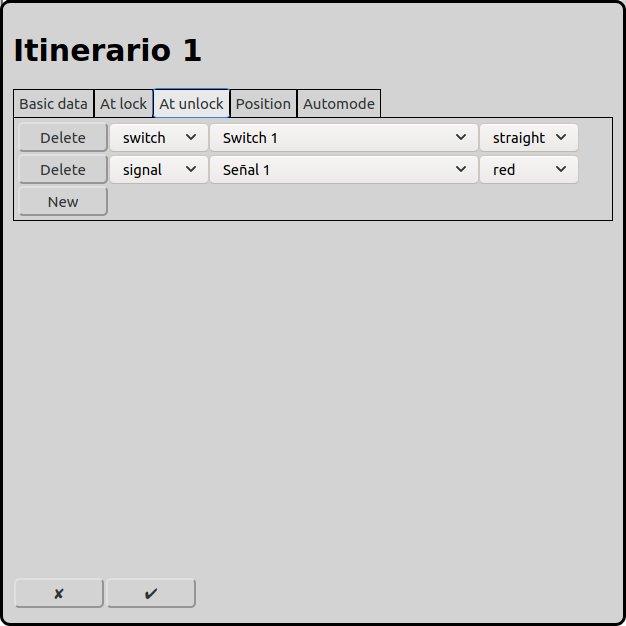
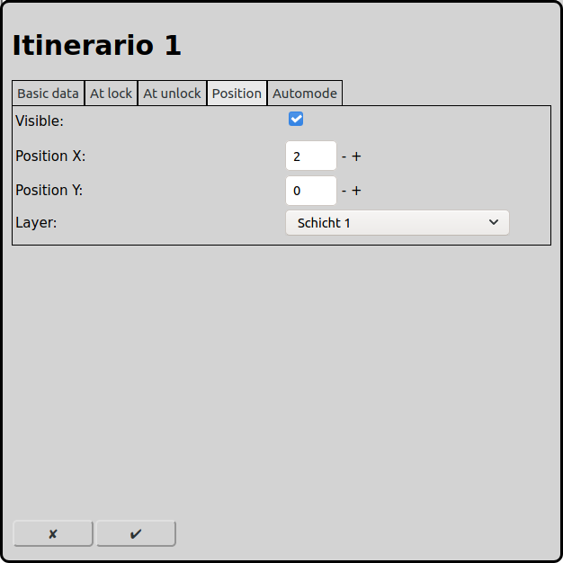
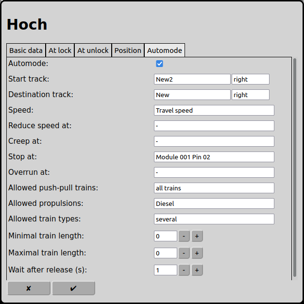

# Configuration of Routes

On the main screen one can open the configuration of the routes with the icon .

## Basics
### Manual Operation
In manual operation routes can be used to change the state of several elements with one click. This can be switches, signals and accessories.

### Automatic Operation
In automatic operation routes are important elements. Trains always run on routes from a start track to a destination track. All elements in between (switches, signals, tracks and accessories) have to be included in tab "At lock". Then these elements are reserved for the train running on this route. Other trains can not use these elements anymore. When the train on the route has reached its destination track, the start track and all elements are released and can be used by other trains again.

In automatic operation RailControl can also operate elements when the train has reached its destination track (tab "At unlock").

## Basic data

### Name
Every route requires a unique name. If there is no name RailControl chooses a name for you and if the name is not unique it will be prefixed with a number to make it unique.

### Waiting time between members (ms)
The elements registered in the tabs "At lock" and "At unlock" must not be operated at the same time. The delay in between has to be selected that the first switch has finished changing bevor the next element starts changing. So only one element requires electrical current at the same time. Magnetic drivers only require few time ( around 100ms), in contrary motor drivers and servos need more time (dependent of model and decoder settings up to 1 second).

## At lock

Here can be added switches, signals, accessories, tracks and loco functions.

In manual operation, when a route is operated with a mouse click, switches, signals and accessories will be operated according the entered state. Tracks and loco functions have no effect in manual operation.

In automatic operation, when a route is operated by a locomotive, all elements will be reserved that are listed in tab "At lock". From then on all these elements can not be claimed by another route and the elements can not be operated manually any more. Then all elements are set to the state entered. When the locomotive has reached its destination track all elements are released and can be claimed by another route and can be operated manually again.

## At unlock

Here can be added switches, signals, accessories, tracks and loco functions.

In manual operation, when a route is operated with a mouse click, these elements are not considered.

In automatic operation, when a route is operated by a locomotive and the locomotive has reached its destination track, all the entered elements will be operated according to the state entered.

## Position

### Visible
A route can be visible on the track layout or not. A route that is only used for automatic oparation can be invisible, unless the are not used manually too. Manually operated routes have to be visible, otherwise the can not be executed.

If the visibility of a route is turned off the following fields are not shown.

### Position X
The position of the element in squares from the left of the track diagram. Counting starts at zero. If an element is bigger then one square the square at the top left is relevant for the counting.

### Position Y
The position of the element in squares from the top of the track diagram. Counting starts at zero. If an element is bigger then one square the square at the top left is relevant for the counting.

### Layer
The layer the element should be visible on.

## Automode

### Automode
If a route should be used in automode this can be selected here.

If the route should not be used in automode the following fields will not be displayed.

### Start track
A train starts an automatic run always in a start track, which must be selected here. Also there must be selected the direction in which the train leaves the start track.

### Destination track
A train ends an automatic run always in a destination track, which must be selected here. Also there must be selected the direction in which the train arrives the start track.

### Speed
The speed that the train uses to run on this route. I.e. if there are switches in turnout position that have to be used, a train can run with reduced speed on the route.

### Reduce speed at
If the train reaches this feedback, the speed is reduced, if there is not already prepared a following route. The selection of this feedback is optional.

### Creep speed at
If the train reaches this feedback, the speed is set to creep speed, if there is not already prepared a following route. The selection of this feedback is optional.

### Stop at
If the train reaches this feedback, the train is stopped, if there is not already prepared a following route. The selection of this feedback is mandatory.

### Overrun at
If the train reaches this feedback, RailControl turns off the electric current, if there is not already prepared a following route. The selection of this feedback is mandatory. This feedback is an additional instrument to prevent accidents if a train does not stop at the desired position. The selection of this feedback is optional.

### Allowed pus-pull trains
All trains: All trains can use this route.

No push-pull trains: Only push-pull trains are not allowed to use this route.

Push-pull trains only: Only push-pull trains are allowed to use this route.

### Allowed propulsion
With this selection can be made restrictions which trains can run on a route or not. For example an electric train must not run on a line that is not electrified or a steam locomotive must not enter an underground track.

### Allowed train types
With this selection can be made restrictions which train types can run on a route or not. For example passenger trains should enter a passenger station and a cargo train should run to the cargo station.

### Minimal train length
The minimal train length a train must have to use this route. The train length can be entered in locomotive settings.

### Maximal train length
The maximal train length a train must have to use this route. The train length can be entered in locomotive settings.

### Wait after release (s)
When a train reached its destination track it must wait this time in seconds befor the train can continue on the next route in automode. A value of 0 means that the train can continue its journey immediately.

