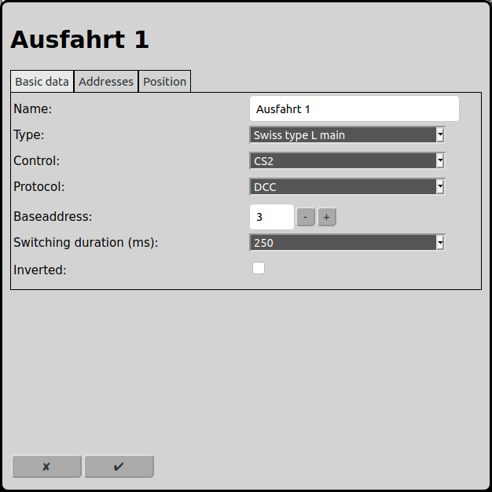
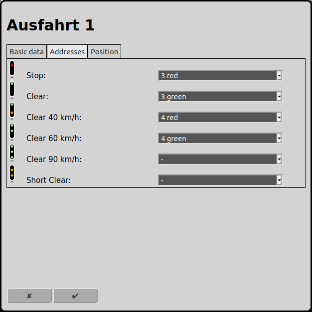
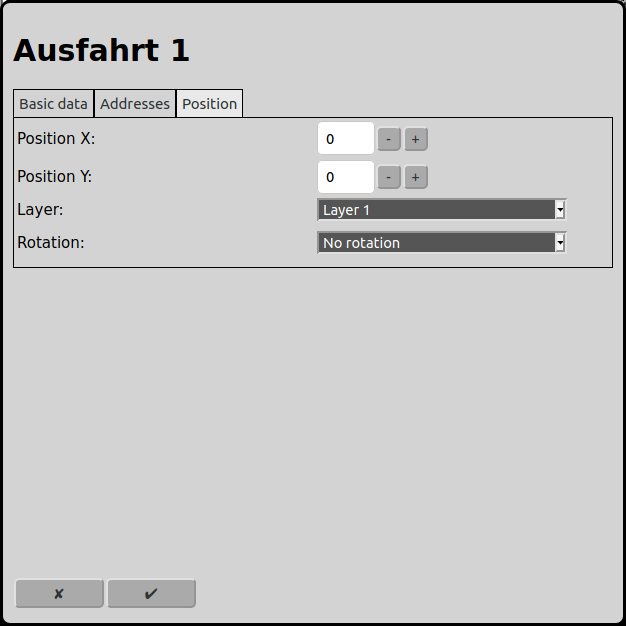

# Configuration of Signals
On the main screen one can open the configuration of the signals with the icon .

## Basic data

### Name
Every signal requires a unique name. If there is no name RailControl chooses a name for you and if the name is not unique it will be prefixed with a number to make it unique.

### Orientation
Obsolete. Is only shown if this signal is configured as start or target in a route. Will be removed in future versions.

Please replace this signal in the route by a track and associate this signal to this track (if needed).

### Type
RailControl knows different signal types (more are planned):

Simple left: It is a simple signal that only has the two aspects "stop" and "clear". It is located on the left side of the track.

Simple right: It is a simple signal that only has the two aspects "stop" and "clear". It is located on the right side of the track.

Swiss dwarf: The dwarf signal from Switzerland has the aspects "stop", "clear" and "caution". See also: [Swiss railway signaling](https://en.wikipedia.org/wiki/Swiss_railway_signalling).

Swiss L main: The main L signal from Switzerland has the aspects "stop", "clear", "40 km/h", "60 km/h", "90 km/h" y "short clear". See also: [Swiss railway signaling](https://en.wikipedia.org/wiki/Swiss_railway_signalling).

German Ks: The Ks signal from German has the aspects "stop", "clear", "shunting, "caution", "dark" and "stop expected".

### Length
Obsolete. Is only shown if this signal is configured as start or target in a route. Will be removed in future versions.

Please replace this signal in the route by a track and associate this signal to this track (if needed).

### Control
If more than one control is configured by RailControl, the control that controls the switch has to be selected. Otherwise the selection is not shown at all. If there is only one control configured the field is not visible.

### Protocol
If the control supports more than one digital protocol, the protocol that is used by de signal has to be selected. If the control only supports one protocol the field is not visible.

### Baseaddress
The digital address that is used by the signal has to be entered. Under "Addresses" the address can be chosen for each aspect. The baseaddress entered here is the lowest possible address that can be chosen.

### Switching duration (ms)
The accessories have to be turned on and after the effective switching turned off again. New accessories can switch within 100ms. Older and inert accessories require 250ms to switch. Some controls handle the switching time itself, so 0ms can be chosen. Dependent on the signal type turning off is not needed, especially servo and motordrivers and corresponding decoders do not need it.

### Inverted
If a signal is connected inverted to the decoder, RailControl can invert this virtually again.

## Addresses

Dependent of the signal type chosen in "Basic data" the possible aspects of the signals will be shown here. For each aspect an address can be chosen, based on the baseaddress in "Basic data". The default is to use ascending addresses starting with the baseaddress.

## Position

### Position X
The position of the element in squares from the left of the track diagram. Counting starts at zero. If an element is bigger then one square the square at the top left is relevant for the counting.

### Position Y
The position of the element in squares from the top of the track diagram. Counting starts at zero. If an element is bigger then one square the square at the top left is relevant for the counting.

### Layer
The layer the element should be visible on.

### Rotation
The elements can be rotated in steps of 90 degrees.

## Feedbacks
Obsolete. Is only shown if there is already a feedback configured. Will be removed in future versions.

Please replace this signal in the route by a track and associate this signal to this track. Then remove all configured feedbacks here.

## Automode
Obsolete. Is only shown if this Signal is configured as start or target in a route. Will be removed in future versions.

Please replace this signal in the route by a track and associate this signal to this track.

