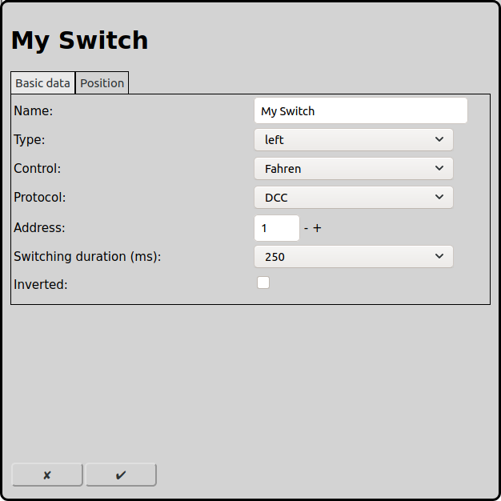
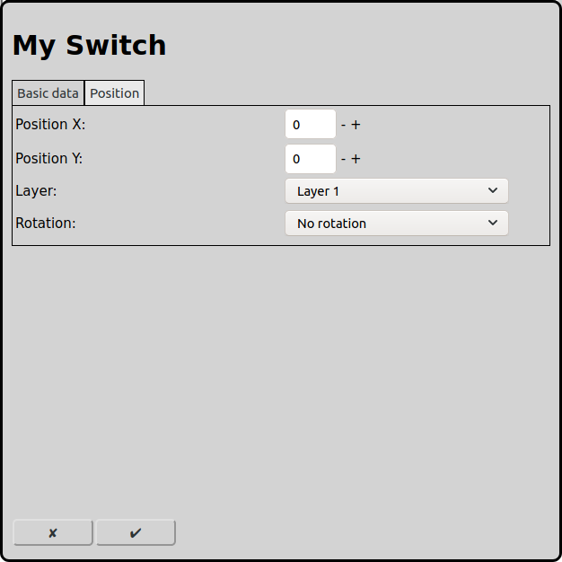

# Configuration of Switches
On the main screen one can open the configuration of the switches with the icon .

## Basic data

### Name
Every switch requires a unique name. If there is no name RailControl chooses a name for you and if the name is not unique it will be prefixed with a number to make it unique.

### Type
RailControl knows different switch types:

left: On the tracklayout this is shown as a left turnout switch. This is not neccessary equal on the real layout.

right: On the tracklayout this is shown as a right turnout switch. This is not neccessary equal on the real layout.

threeway: This type represents two switches at the same position. One of the logical ways is not possible in praxis. Railcontro restricts the usage of this forth logical possibility. The selected address is used for the left switch and the following address is used for the the right switch.

Märklin Double Slip Switch left: In contrary to other manufacturers Märklin Double Slip Switches only have one motor.

Märklin Double Slip Switch right: In contrary to other manufacturers Märklin Double Slip Switches only have one motor.

Double crossing switches with two motors have to be configured as two seperate switches. Important is that the physical switch motor on the left is controled by the switch on the right on the layout of RailControl and vise versa.

### Control
If more than one control is configured by RailControl, the control that controls the switch has to be selected. Otherwise the selection is not shown at all. If there is only one control configured the field is not visible.

### Protocol
If the control supports more than one digital protocol, the protocol that is used by the switch has to be selected. If the control only supports one protocol the field is not visible.

### Address
The digital address that is used by the switch has to be entered.

### Switching duration (ms)
The accessories have to be turned on and after the effective switching turned off again. New accessories can switch within 100ms. Older and inert accessories require 250ms to switch. Some controls handle the switching time itself, so 0ms can be choosen. Dependent on the accessory type turning off is not needed, especially servo and motordrivers and corresponding decoders do not need it.

### Inverted
If an accessory is connected inverted to the decoder, RailControl can invert them virtually again.

## Position

### Position X
The position of the element in squares from the left of the track diagram. Counting starts at zero. If an element is bigger then one square the square at the top left is relevant for the counting.

### Position Y
The position of the element in squares from the top of the track diagram. Counting starts at zero. If an element is bigger then one square the square at the top left is relevant for the counting.

### Layer
The layer the element should be visible on.

### Rotation
The elements can be rotated in steps of 90 degrees.

