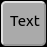
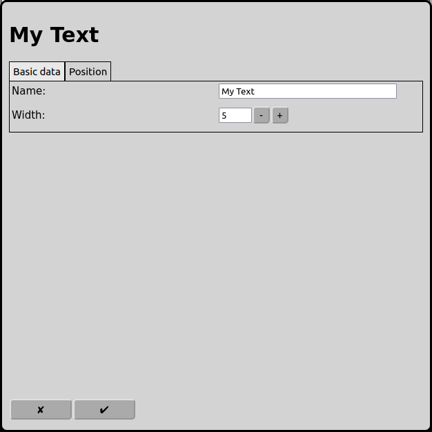
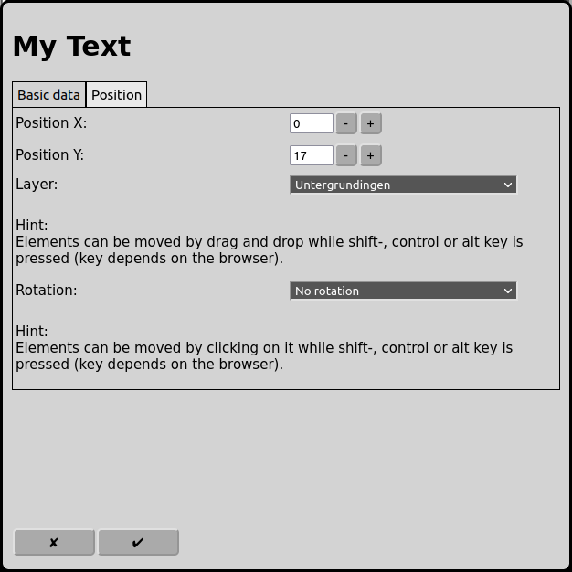

# Configuration of Texts
On the main screen one can open the configuration of the texts with the icon .

## Basic data

### Name
Every signal requires a unique name.

The name of the text is also the text that is shown on the layout.

If there is no name RailControl chooses a name for you and if the name is not unique it will be prefixed with a number to make it unique.

### Width
The text is limited in width. The width can be set here.

## Position

### Position X
The position of the element in squares from the left of the track diagram. Counting starts at zero. If an element is bigger then one square the square at the top left is relevant for the counting.

### Position Y
The position of the element in squares from the top of the track diagram. Counting starts at zero. If an element is bigger then one square the square at the top left is relevant for the counting.

### Layer
The layer the element should be visible on.

### Rotation
The elements can be rotated in steps of 90 degrees.

