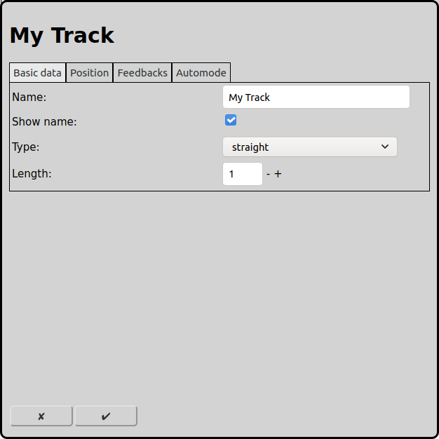
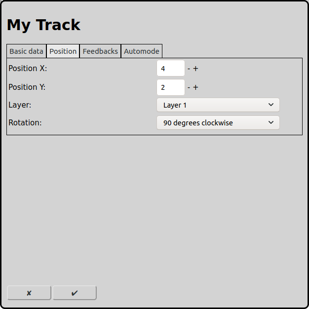
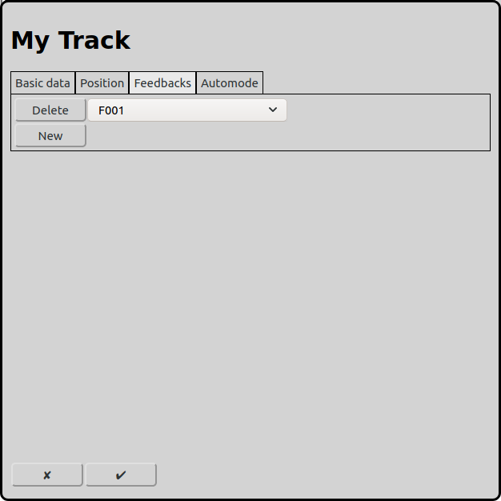
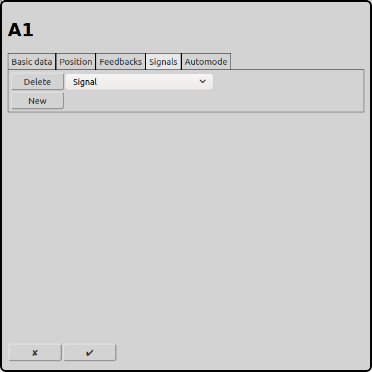
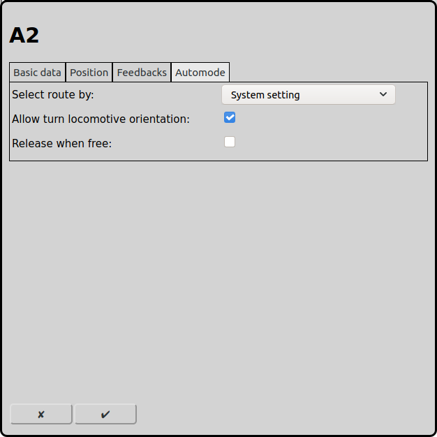

# Configuration of Tracks
On the main screen one can open the configuration of the tracks with the icon .

On the layout the tracks are very important elements. With the track elements the layout of the model railway can be designed. The tracks are also very important for the automatic operation, because all routs start or end at a track or a signal.

## Basic data

### Type
RailControl knows different track types. Further settings can be made depending on the track type selected.

Straight: A simple straight peace of track. It is recommended to use a straight track as start or destination track in a route. Basically every track type is available as start or destination track.

Curve: A peace of track that is 45 degrees rotated.

End / Buffer Stop: Symbolizes the end of a track or a buffer stop.

Bridge: Symbolizes a bridge.

Tunnel (two sides): Symbolizes a tunnel. Both ends of the tunnel are integrated in one element. The empty squares in between can not be used for other elements.

Tunnel (one side): Symbolizes a tunnel. It makes sense to always two of these elements.

Link: Symbolizes a track that continues on another layer.

Crossing left: Symbolizes a simple crossing without switches. One track is straight and the other is rotated 45 degrees to the left.

Crossing right: Symbolizes a simple crossing without switches. One track is straight and the other is rotated 45 degrees to the right.

Crossing symmetric: Symbolizes a simple crossing without switches. One track is rotated 45 degrees to the left and the other is rotated 45 degrees to the right.

### Main track
Particularly in automatic mode, a track section/block can extend over several physical track sections such as bridges and tunnels. In this case, it makes sense to define a main track and attach the other tracks to it. Such an attached track behaves identically to the main track, i.e. it has the same context menus and the same illumination as the main track.

### Name
Every track requires a unique name. If there is no name RailControl chooses a name for you and if the name is not unique it will be prefixed with a number to make it unique.

### Show name
Straight tracks can show the name of the track. If a track is the source or the destination of a route this is helpful. If a layout is used only for manual operation usually the names are not needed.

### Display name
This text is displayed as a description in the overview. The displayed name does not have to be unique. If this field is empty, the text that was entered as the name is displayed.

### Length
Some track types can be configured to be longer then only one square on the track diagram. The number represents the length in squares of the track.

## Position

### Position X
The position of the element in squares from the left of the track diagram. Counting starts at zero. If an element is bigger then one square the square at the top left is relevant for the counting.

### Position Y
The position of the element in squares from the top of the track diagram. Counting starts at zero. If an element is bigger then one square the square at the top left is relevant for the counting.

### Layer
The layer the element should be visible on.

### Rotation
The elements can be rotated in steps of 90 degrees.

## Feedbacks

To each track one can assign feedbacks. The assigned feedbacks reflect the usage of a track. In automode a route can only use feedbacks as destination that are assigned to the destination track.

## Signals

Signals can be associated to a track. Associated signals will be set to indication stop when a route is released or when under automode "Release when free" is selected and the track is released (all feedbacks are free).

## Automode

### Select route by
In automatic operation RailControl has to choose a route if there are several possibilities. The priority to choose a route can be controlled with different concepts. Routes that are actually used will never be chosen.

System setting: The setting in [General Settings](#general-settings) is used.

Do not care: The chosen route is not important. Usually the first configured route will be chosen.

Random: The route is chosen by random.

Shortest track: The route with the shortest destination track will be chosen.

Longest unused: The route that is not used for the longest time will be chosen.

### Allow turn locomotive orientation
This allows a locomotive to turn the orientation on this track. Therefore a configured route starting in the other direction and the locomotive has to be configured as a push-pull train.

This makes sense at a station where push-pull trains turn its running direction.

### Release when free
A track can be freed if no more related feedbacks are active. So in automode a track can be released before the train reaches its destination feedback but already has left the starting track of the route.
This setting is only useful, if a track is completely and continuously observed by feedbacks with contact rails, axlecounters or other methods that reliable detect vehicles on a track.

