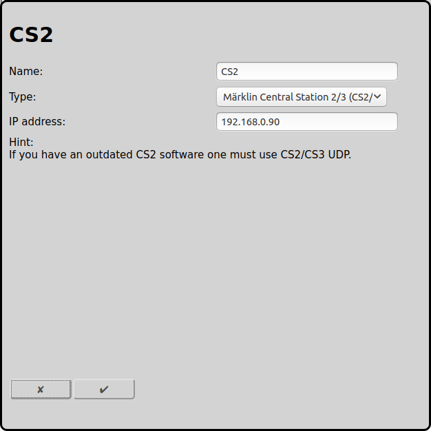

## Configuration of Märklin Central Station 2/3 (CS2/3) with TCP (new)

The new but undocumented connection to a CS2/CS3 with TCP is described here.

There is also an old and documented [connection to a Central Station 2/3 with UDP](#configuration-of-märklin-central-station-23-cs23-with-udp-old).

### Configuration of the CS2/CS3

At Setup/Configuration/IP there must be entered an IP address and a corresponding netmask. The IP address entered here must be used in the configuration field in RailControl later. IP gateway und DNS server are not used by RailControl, they are only needed for the CS2/CS3 online update.

### Configuration of RailControl

The name is only used for the user. Especially if there are configured more then one controls it is really needed.

Additionally there has to be configured the IP address of the CS2/CS3:

### Configuration of the Firewall

There is an outgoing connection to the port 15731 of the CS2/CS3 needed. For that usually there is no configuration needed.

