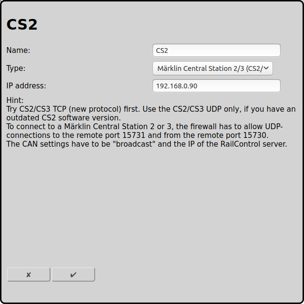

## Configuration of Märklin Central Station 2/3 (CS2/3) with UDP (old)

The old and documented connection version is UDP. This is described here.

There is a new and undocumented [connection verison of the Central Station 2/3 with TCP](#configuration-of-märklin-central-station-23-cs23-with-tcp-new), which should be prefered.

To use RailControl with a Central Station 2/3 from Märklin with UDP we recommend to use a fix IP address. It is also posible to use DHCP but it is more complex and therefore not explained here.

### Configuration CS2/CS3

At Setup/Configuration/IP there must be entered an IP address and a corresponding netmask. The IP address entered here must be used in the configuration field in RailControl later. IP gateway und DNS server are not used by RailControl, they are only needed for the CS2/CS3 online update.

CS2/CS3 has to know how to connect to RailControl. Therefore in the CAN setup theere must be entered broadcast and the IP address of the RailControl server (in this example 192.168.0.99).

### Configuration of RailControl

The name is only used for the user. Especially if there are configured more then one controls it is really needed.

Additionally there has to be configured the IP address of the CS2/CS3:

### Configuration of the firewall

A firewall has to pass all data from the RailControl server to the UDP port 15731 of the CS2/CS3. Also all data of the CS2/CS3 has to be allowed from the CS2/CS3 to the RailControl server at UDP port 15730. The first is usually allowed by default, the last has to be allowed in the firewall explicitely. If you have a completely seperated network without internet connection, you can switch off the firewall completely.

