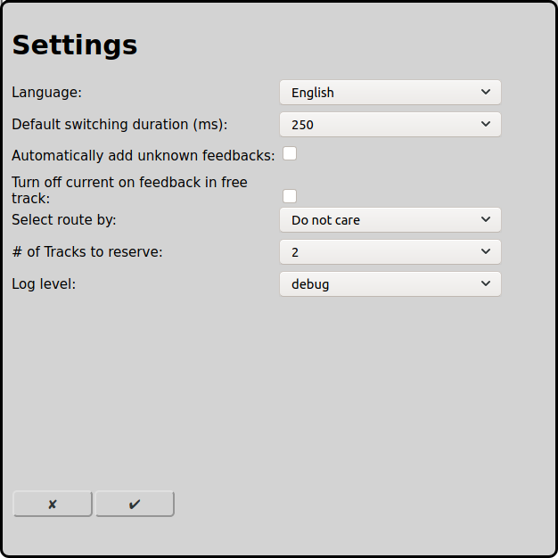

# General Settings
To run RailControl correctly, some settings are required.

On the main screen one can open the configuration of the setting with the icon :

## Basic Data
### Language
The language of RailControl can be choosen. All texts will be displayed in this language. Available languages are English, German and Spanish.

### Log level
The level when actions are logged.

Errors: All serious errors will be logged.

Warnings: Additionally warnings will be logged. Usually a correct execution of RailControl will not be possible any more.

Information: All actions will be logged. This setting is recommended.

Debug: All actions will be logged. Especially if you want to find an error this setting makes sense.

## Startup
### Initianlization of locos
The locomotives can be initialized when starting RailControl. The speed is set to 0 for all locomotives and the functions are set to the last known statuses.

No initialization: The locomotives are not initialized when RailControl is started.

Speed only: The speed of the locomotives is set to 0 when RailControl is started.

Speed and functions: The speed of the locomotives is set to 0 when RailControl is started and the functions are set to the last known states.

Translated with DeepL.com (free version)

## Feedback
### Automatically add unknown feedbacks
Most controls send information about changing [feedbacks](#configuration-of-feedbacks) even if they are not configured by RailControl. RailControl can use this information to automatically configure those feedbacks.

### Turn off current on feedback in free track
If this option is selected RailControl turns off current and blocks a track if a feedback is activated in a given track but RailControl does not expect a train in this track.

## Accessory
### Default switching duration (ms)
The accessories have to be turned on and after the effective switching turned off again. New accessories can switch within 100ms. Older and inert accessories require 250ms to switch. Some controls handle the switching time itself, so 0ms can be choosen.

### Execute accessories
when in wrong position: RailControl only sends a switching command to the control center if the accessory item is in the wrong position.

always: RailControl always sends a switching command to the control center, regardless of the position of the accessory item.

## Automode
### Select route by
In automatic operation RailControl has to choose a route if there are several possibilities. The priority to choose a route can be controlled with different concepts. Routes that are actually used will never be chosen.

Do not care: The chosen route is not important. Usually the first configured route will be chosen.

Random: The route is chosen by random.

Shortest track: The route with the shortest destination track will be chosen.

Longest unused: The route that is not used for the longest time will be chosen.

### # of tracks to reserve
The number of tracks that will be reserved in automatic operation. If only one route is reserved the train stops at the end of each route.

