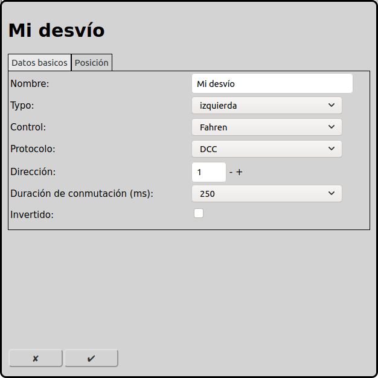
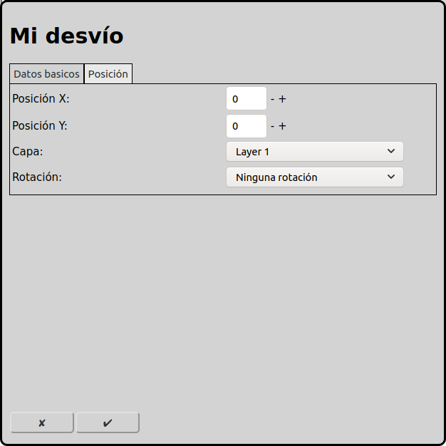

# Configuración de los accesorios
En la pantalla principal se puede ir a la configuración de los accesorios con el icono .

## Datos básicos
TODO FIGURE SEEMS TO BE FALSE

### Nombre
Cada accesorio necesita un nombre inequívoco. Si el nombre no está indicado RailControl crea un nombre. Si el nombre ya existe RailControl añade un numero al nombre para hacer el nombre inequívoco.

### Control
Si hay más que un control configurado en RailControl, se tiene que seleccionar el control que controla el accesorio. Si solamente un control está configurado en RailControl el campo de selección no está visible.

### Protocolo
Si un control soporta más que un protocolo, se tiene que seleccionar el protocolo que controla el accesorio. Si el control solamente soporta un protocolo, el campo de selección no está visible.

### Dirección
La dirección que controla el desvío.

### Duración de conmutación (ms)
Después del procedimiento de conmutación se tiene que apagar los accesorios. Se puede apagar los nuevos accesorios después de 100ms. A veces accesorios más viejos o lentos necesitan 250ms. Algunos controles apagan los accesorios automáticamente con un valor que se puede configurar directamente por el control. En este caso se puede configurar 0ms aquí. 

### Invertido
Cuando los conectores del accesorio están conectado invertido, RailControl puede invertir otra vez.

## Position
TODO FIGURE SEEMS TO BE FALSE

### Posición X
La posición del elemento en cuadros deste la izquierda en el diagrama de vías. Se empieza a contar con zero. Si un elemento es más grande que un cuadrado el cuadrado izquierda arriba es importante para contar.

### Posición Y
La posición del elemento en cuadros deste arriba en el diagrama de vías. Se empieza a contar con zero. Si un elemento es más grande que un cuadrado el cuadrado izquierda arriba es importante para contar.

### Capa
La capa en que el elemento está visible.

### Rotación
Se puede rotar los elementos en pasos de 90 grados.

