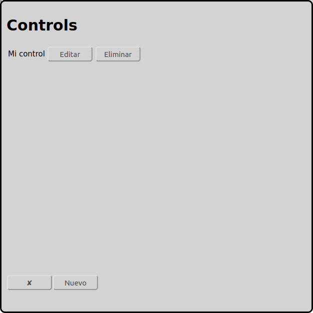

# Configuración de controles
En la pantalla principal se puede ir a la configuración de controles con el icono :

En el ejemplo arriba ya hay un control configurado con el nombre "Mi control".

Abajo hay un botton "Nuevo" para añadir más controles.

Normalmente solamente un control es necesario. Una maqueta ferroviaria grande puede utilizar controles dedicados para las locomotoras, para los desvios y para los retroseñales.

Actualmente RailControl soporte los controles abajo:

* Arduino 	DCC-EX (formerly DCC++EX formerly DCC++)
* CAN-Digital-Bahn 	[CC-Schnitte 2.1](#configuración-de-cc-schnitte)
* Digikejis 	DR5000
* ESU 	ECoS/Central Station Reloaded
* Fleischmann 	[Twin-Center](#configuración-de-fleischmann-twin-center)
* LDT 	[HSI-88 RS232](#configuración-de-hsi-88-rs232)
* KM-1 	System Control 7
* Märklin 	[Central Station 2/3 with TCP (new)](#configuración-de-märklin-central-station-23-cs23-con-tcp-reciente)
* Märklin 	[Central Station 2/3 with UDP (old)](#configuración-de-märklin-central-station-23-cs23-con-udp-anticuado)
* Märklin 	[Interface 6050/6051](#configuratión-de-märklin-interface-60506051)
* OpenDCC 	[OpenDCC Z1](#configuración-de-opendcc-z1)
* Roco 	[Z21/z21](#configuratión-de-roco-z21)
* Tams 	[MasterControl](#configuración-de-tams-mastercontrol)
* Tams 	[MasterControl 2](#configuración-de-tams-mastercontrol-2)
* Tams 	[RedBox](#configuración-de-tams-redbox)
* Uhlenbrock 	Adapter 63120
* Uhlenbrock 	Adapter 63820
* Uhlenbrock 	[Intellibox](#configuración-de-uhlenbrock-intellibox)
* Uhlenbrock 	Intellibox II

