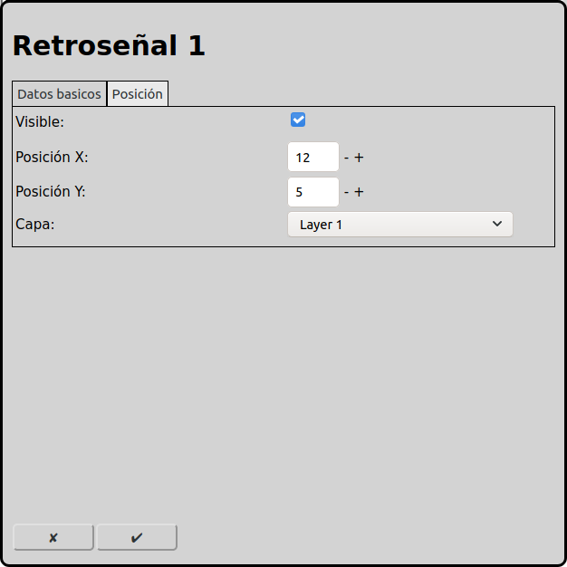

# Configuración de las retroseñales
En la pantalla principal se puede ir a la configuración de las retroseñales con el icono .

Retroseñales están necesario en operación automática para detectar la posición de los trenes. Así RailControl puede parar los trenes cuando los han llegado su destino.

## Datos basicos

### Nombre
Cada retroseñal necesita un nombre inequívoco. Si el nombre no está indicado RailControl crea un nombre. Si el nombre ya existe RailControl añade un numero al nombre para hacer el nombre inequívoco.

### Control
Si hay más que un control configurado en RailControl, se tiene que seleccionar el control que controla la retroseñal. Si solamente un control está configurado en RailControl el campo de selección no está visible.

### Contacto
El numero del contacto físico. La mayoría de los controls empiezan numerar con uno. Algunos controls conocen algoritmos complicados para los números de los contactos. Por favor contacte la documentación del control y/o de los retroseñales.

Cunado no está claro cual contacto físico tiene cual numero, se puede activar "Añadir retroseñales desconosidas automaticamente" en los [opciones generales](#opciones-generales). Con eso RailControl añade los retroseñales desconosidas automaticamente. Despues en la capa del control las retroseñales están visibles.

### Invertido
Se puede invertir la logica de las retroseñales. Normalmente un retroseñal cerrado está interpretado como activo. Cuando una retroseñal abierta sería interpretado como activo se puede invertir aquí.

## Posición

### Visible
Se puede mostrar una retroseñal en el diagrama de vías o no. Cuando una retroseñal está asociado a una vía, el estado cumulado de todas retroseñales está mostrado en la vía. En este caso se puede hacer invisible la retroseñal. En todos casos los retroseñales están visible en la capa del control.

Cuando una retroseñal no está visible los campos proximos están invisible también.

### Posición X
La posición del elemento en cuadros deste la izquierda en el diagrama de vías. Se empieza a contar con zero.

### Posición Y
La posición del elemento en cuadros deste arriba en el diagrama de vías. Se empieza a contar con zero.

### Capa
La capa en que el elemento está visible.

