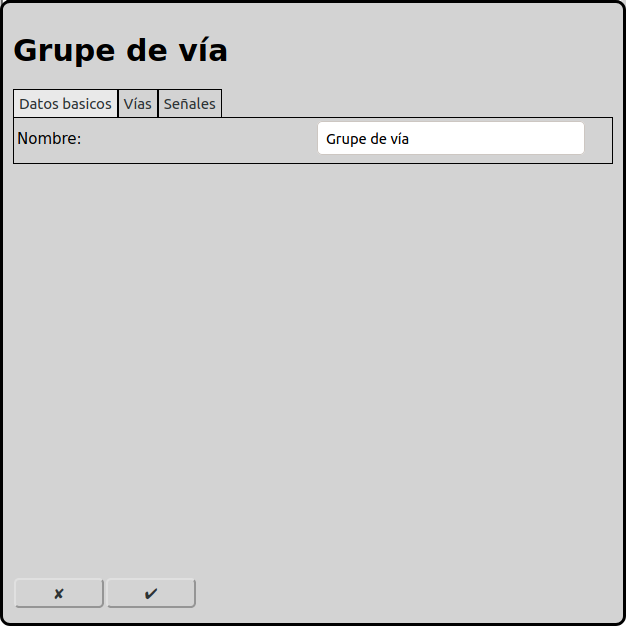
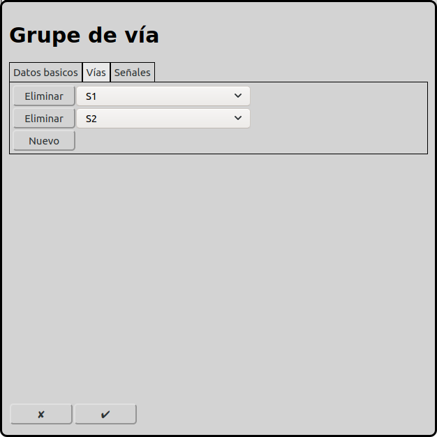

# Configuración de los grupos de vía
En la pantalla principal se puede ir a la configuración de los grupos de vía con el icono .

Los grupos de vía tienen efecto solamente en el autómodo. Todas las vías de un grupo de vía se puede entrar solamente de un lado. Dos trenes no pueden entrar una linea de vías de ambos lados. Pero es posible que un tren sigue a otro tren en la misma linea y en la misma orientación.

## Datos basicos

### Nombre
Cada grupo de vías necesita un nombre inequívoco. Si el nombre no está indicado RailControl crea un nombre. Si el nombre ya existe RailControl añade un numero al nombre para hacer el nombre inequívoco.

## Vías

Se puede seleccionar todas las vías que son parte del grupo de vías.

## Señales
Obsoleto. Solamente está mostrado si ya hay señales configurado. Estaré eliminado en versiones futuras.

