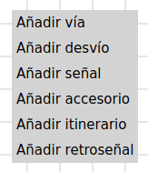

# Configuración de las capas
En la pantalla principal se puede ir a la configuración de las capas con el icono . Se puede añadir, configurar y eliminar capas y se las puede seleccionar en el diagrama de vías.

A la derecha de la pantalla se puede configurar y mostrar un diagrama de las vías de la maqueta. Se puede añadir, configurar y manejar vías, desvíos, señales y retroseñales. Para maquetas grandes se puede añadir y seleccionar varios capas.

Con un clic derecho en un area vacío se puede añadir elementos nuevos en este lugar:

