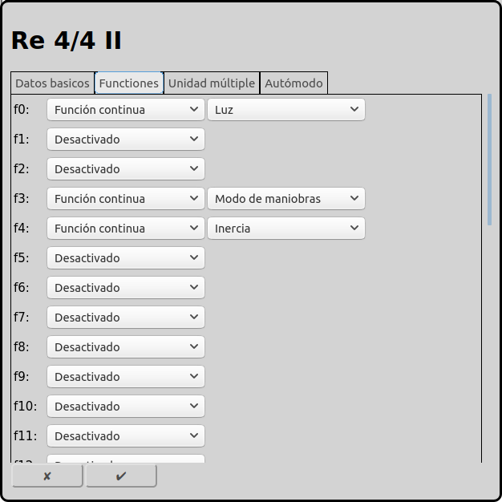
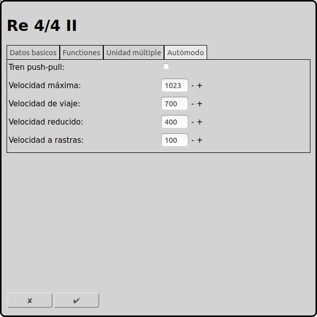

# Configuración de las locomotoras
Cada locomotora en la maqueta tiene que ser configurado para ser controlado por RailControl.

En la pantalla principal se puede ir a la configuración de las locomotoras con el icono . Una otra posibilidad es usar el icono  en la locomotora selectionada.

## Datos basicos

### Nombre
El nombre de la locomotora es la unica identificación. El mismo nombre solo puede ser usado una vez. Algunos controls usan el nombre para syncronizar la base de datos de las locomotoras (por ejemplo Märklin CS2/CS3).

### Control
Si hay más que un control configurado en RailControl, se tiene que seleccionar el control que controla la locomotora. Si solamente un control está configurado en RailControl el campo de selección no está visible.

### Protocolo
Si un control soporta más de un protocolo, se tiene que seleccionar el protocolo que controla la locomotora. Si el control solamente soporta un protocolo, el campo de selección no está visible.

### Dirección
La dirección que controla la locomotora.

### Longitud del tren
Longitud del tren, preferido en cm. Está usado en el modo automatico para decidir si un tren puede entrar un itinerario o una vía de destino.

### Propulsión
La propulsión del tren. Está usado en el modo automatico para decidir si un tren puede usar un itinerario.

### Tipo de tren
El tipo del tren. Está usado en el modo automatico para decidir si un tren puede usar un itinerario.

## Funciones

Depende del decoder en la locomotora, se puede asignar hasta 32 funciones por locomotora. Siempre se cuenta deste cero.

### Typo
RailControl conoce dos tipos de funciones: la función permanente y la función de instantánea.

Se puede activar la función permanente con un clic y desactivar con un segundo clic. Es para el luz, el sonido de condución, el modo de maniobra y otras acciones permanentes.

La función de instantánea esta activa durante el clic. Es para el cuerno, descoplar, anuncios de voz y control de grúa.

### Simbolo
En RailControl hay tantos simbolos disponibles para seleccionar.

## Autómodo

### Tren push-pull
Un tren push-pull puede correr en ambos direcciones. En el autómodo RailControl puede cambiar la dirección de marcha. Si tren push-pull no está seleccionado RailControl no cambia la dirección de marcha.

### Velocidad máxima
Se puede ajustar la velocidad máxima. Es importante en el modo manual. Si se cambia la velocidad desde el control se puede exceder la velocidad máxima.

### Velocidad de viaje
Es la velocidad que RailControl usa en el autómodo normalmente.

### Velocidad reducido
Es la velocidad que RailControl usa en el autómodo cuando la primera retroseñal ha llegado.

### Velocidad a rastas
Es la velocidad que RailControl usa  en el autómodo cuande la segunda retroseñal ha llegado.

