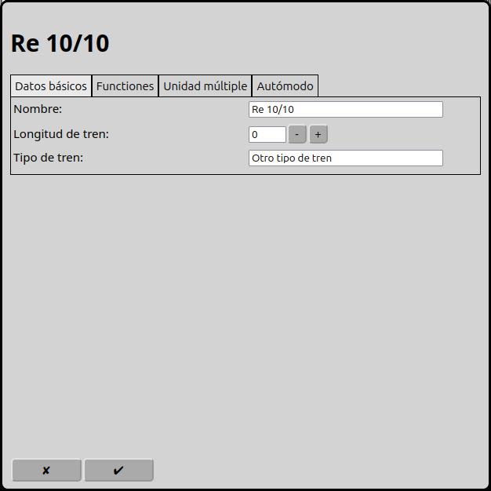
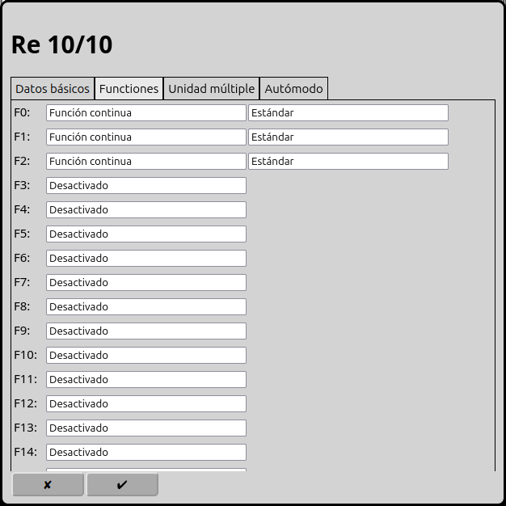
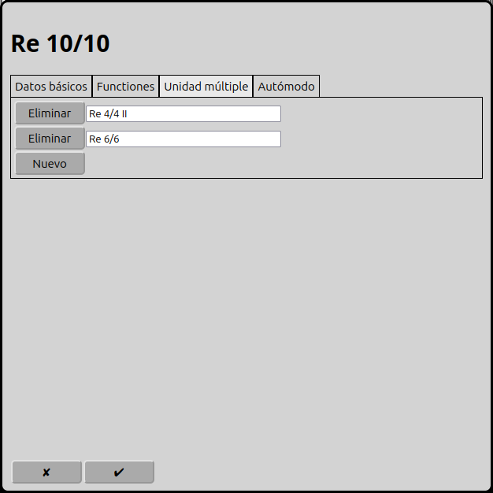
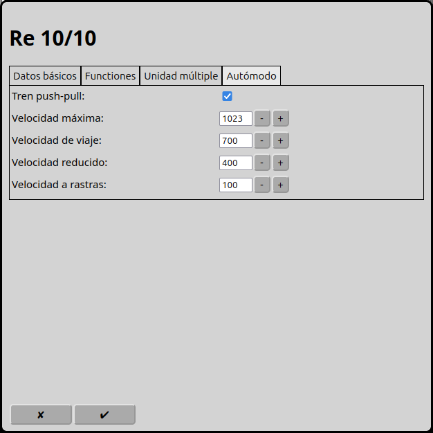

# Configuración de las unidades múltiples
RailControl soporta unidades múltiples. Por esto todas las locomotoras deben que correr en el mismo nivel de velocidad. Además todas las locomotoras deben conocer la orientación absoluta y el mismo numero de niveles de velocidad. Especialmente Märklin Motorola 1 no conoce la orientación absoluta.

En la pantalla principal se puede ir a la configuración de las unidades múltiples con el icono . Una otra posibilidad es usar el icono  en la unidad múltiple selectionada.

## Datos basicos

### Nombre
El nombre de la unidade múltiple es la unica identificación. El mismo nombre solo puede ser usado una vez.

### Longitud del tren
Longitud del tren, preferido en cm. Está usado en el modo automatico para decidir si un tren puede entrar un itinerario o una vía de destino.

### Tipo de tren
El tipo del tren. Está usado en el modo automatico para decidir si un tren puede usar un itinerario.

## Funciones

Depende de los decoders en las locomotoras, se puede asignar hasta 32 funciones por locomotora. Siempre se cuenta deste cero. Las functiones usadas están reenviados a todas las locomotoras.

### Typo
RailControl conoce dos tipos de funciones: la función permanente y la función de instantánea.

Se puede activar la función permanente con un clic y desactivar con un segundo clic. Es para el luz, el sonido de condución, el modo de maniobra y otras acciones permanentes.

La función de instantánea esta activa durante el clic. Es para el cuerno, descoplar, anuncios de voz y control de grúa.

### Simbolo
En RailControl hay tantos simbolos disponibles para seleccionar.

## Unidades múltiples

Se puede añadir locomotoras a esta unidad múltiple. Despues todas las locomotoras tienen la misma actitud.

## Autómodo

### Tren push-pull
Un tren push-pull puede correr en ambos direcciones. En el autómodo RailControl puede cambiar la dirección de marcha. Si tren push-pull no está seleccionado RailControl no cambia la dirección de marcha.

### Velocidad máxima
Se puede ajustar la velocidad máxima. Es importante en el modo manual. Si se cambia la velocidad desde el control se puede exceder la velocidad máxima.

### Velocidad de viaje
Es la velocidad que RailControl usa en el autómodo normalmente.

### Velocidad reducido
Es la velocidad que RailControl usa en el autómodo cuando la primera retroseñal ha llegado.

### Velocidad a rastas
Es la velocidad que RailControl usa  en el autómodo cuande la segunda retroseñal ha llegado.

