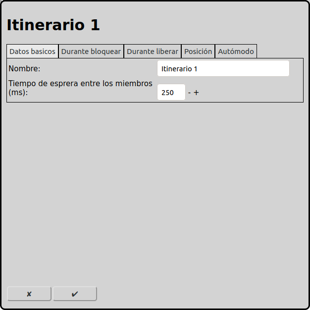
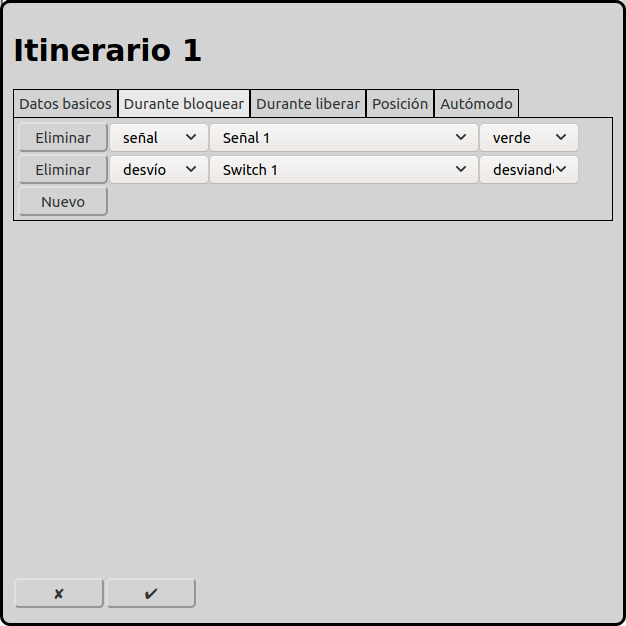
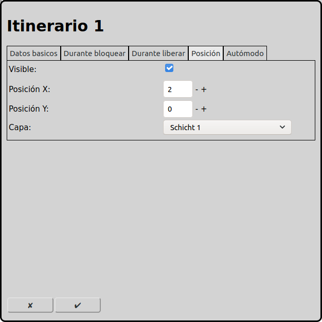
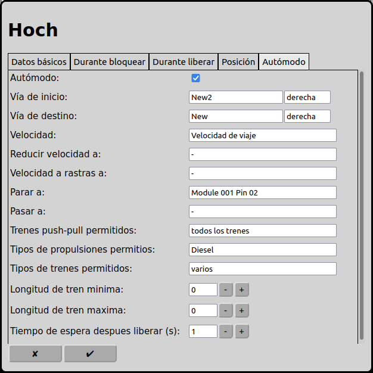

# Configuración de los itinerarios
En la pantalla principal se puede ir a la configuración de los itinerarios con el icono .

## En general
### Operación manual
En operación manual se puede usar itinerarios para cambiar el estado de varios elementos con un click. Los elementos pueden ser desvíos, señales y accesorios.

### Operación automática
En operación automática las itinerarios son los elementos más importantes. Trenes siempre corren en itinerarios de una vía de inicio a una vía de destino. Todos los elements intersticiales (desvíos, señales, vías y accesorios) deben ser registrado en la pestaña "Durante bloquear". Estos elementos están reservado para el tren corriendo en la ruta. Entonces otros trenes no más pueden usar estos elementos. Cuando el tren ha alcanzado la vía de destino, la vía de inicio y todos los elementos intersticiales están liberado y otros trenes pueden usar estos elementos.

En operación automática RailControl puede cambiar el estado de elementos cuando el tren alcanza la vía de destino (pestaña "Durante liberar).

## Datos Basicos

### Nombre
Cada ruta necesita un nombre inequívoco. Si el nombre no está llenado, RailControl crea un nombre. Si el nombre ya existe RailControl añade un numero al nombre para hacer el nombre inequívoco.

### Tiempo de espera entre los miembros (ms)
No se puede operar los elementos registrados en la pestaña "Durante bloquear" y "Durante liberar" al mismo tiempo. Se tiene que seleccionar el tiempo entre operar los elementos que el primer elemento a terminado cambiar el estado antes el segundo elemento. Así solamente un elemento requiere corriente eléctrico al mismo tiempo. Los accionamientos magnéticos solamente necesitan poco tiempo (alrededor 100ms), en contrario los accionamientos con motores y servos necesitan más tiempo (depende del modelo y de la configuración del decoder hasta un segundo).

## Durante bloquear

Aquí se puede registrar desvíos, señales, accesorios, vías y funcciones de locomotoras.

En operación manual, cuando la ruta está operado con un clic del ratón, desvíos, señales y accesorios están operado según el estado registrado. Vías y funcciones de locomotoras no tienen efecto en operación manual.

En operación automática, cuando el itinerario está operado por la locomotora, todos los elementos registrado en "Durante bloquear" están reservado. Entonces todos estos elementos no se puede ser usado por operación manual ni por otros trenes en operación automática. Despues el estado registrado de todos los elemento están operado. Cuando la locomotora ha alcanzado la vía de destino todos los elementos estand liberado y pueden ser usado por otros itinerarios y pueden ser operado manual.

## Durante liberar

Aquí se puede registrar desvíos, señales, accesorios, vías y funcctiones de locomotoras.

En operación manual, cuando el itinerario está operado con un clic del ratón, estos elementos no están considerado.

En operación automática, cuando el itinerario está operado por la locomotora, y el tren ha alcanzado la vía de destino, todos los elementos registrados están operado al estado registrado.

## Posición

### Visible
Se puede mostrar una itinerario en el diagrama de vías o no. Cuando el itinerario solamente está usado en operación automático se puede hacer el icono invisible. Solamente itinerarios usados en operación manual necesitan ser visible.

Cuando un itinerario no está visible los campos próximos están invisible también.

### Posición X
La posición del elemento en cuadros desde la izquierda en el diagrama de vías. Se empieza a contar con zero. Si un elemento es más grande que un cuadrado el cuadrado izquierda arriba es importante para contar.

### Posición Y
La posición del elemento en cuadros desde arriba en el diagrama de vías. Se empieza a contar con zero. Si un elemento es más grande que un cuadrado el cuadrado izquierda arriba es importante para contar.

### Capa
La capa en que el elemento está visible.
 
## Autómode

### Autómode
Cuando un itinerario está usado en autómodo se puede seleccionar aquí.

Cuando un itinerario está usado solamente en modo manual los campos próximos están invisible.

### Vía de inicio
Un tren en autómodo empiece cu viaje en una vía de inicio. También se tiene que seleccionar la orientación el tren sale la vía de inicio.

### Vía de destino
Un tren en autómodo termina cu viaje en una vía de destino. También se tiene que seleccionar la orientación el tren llega la vía de destino.

### Velocidad
La velocidad un tren usa para correr por el itinerario. Si un desvío esta en estado desviado el tren puede usar una velocidad reducida.

### Reducir velocidad a
Si el tren alcanza esta retroseñal, la velocidad del tren está reducido si ya no está preparado un itinerario siguiente. La selección de este retroseñal es opcional.

### Velocidad a rastras a
Si el tren alcanza esta retroseñal, la velocidad del tren está reducido a la velocidad a rastras si ya no está preparado un itinerario siguiente. La selección de este retroseñal es opcional.

### Parar a
Si el tren alcanza esta retroseñal, el tren para si ya no está preparado un itinerario siguiente. La selección de este retroseñal es mandatorio.

### Pasar a
Si el tren alcanza esta retroseñal, RailControl apaga el corriente electrico si ya no está preparado un itinerario siguiente. Esta retroseñal es un instrumento adicional para prevenir accidentes si un tren no para al lugar deseado. La selección de este retroseñal es opcional.

### Trenes push-pull permitidos
Todos los trenes: Todos los trenes pueden usar esta itinerario.

Ningunos push-pull trenes: Push-pull trenes no están permitido usar esta itinerario.

Solamente push-pull trenes: Solamente push-pull trenes están permitido usar esta itinerario.

### Tipos de propulsiones permitidos
Se puede hacer restriciones quales trenes pueden usar un itinerario. Por ejemplo un tren electrico no puede entrar una vía no electroficada o un tren a vapor no puede entrar una vía subterana.

### Tipos de trenes premitodos
Se puede hacer restriciones quales trenes pueden usar un itinerario. Por ejemplo un tren pasajero debe ir a la estación de pasajeros y un tren carga debe ir a la estación de carga.

### Longitud de tren minima
La longitud minima un tren tiene que ser para usar esta itinerario. La longitud del tren puede ser registrado en las opciones de las locomotoras.

### Longitud de tren maxima
La longitud maxima un tren tiene que ser para usar esta itinerario. La longitud del tren puede ser registrado en las opciones de las locomotoras.

### Tiempo de espera después liberar (s)
Cuando un tren alcanza la vía de destino lo tiene que esperar este tiempo en segundos. Después el tren puede continuar su viaje por el itinerario próxima en autómodo. Un valor de 0 significa que el tren no tiene que esperar y puede seguir inmediatamente.

