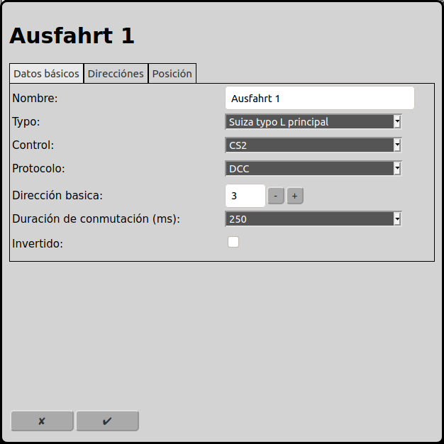
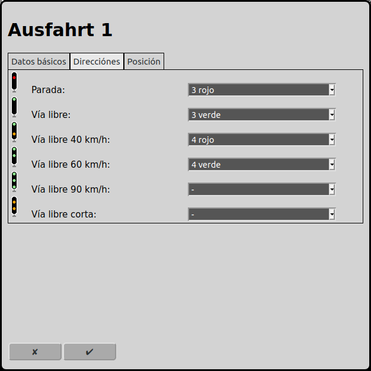
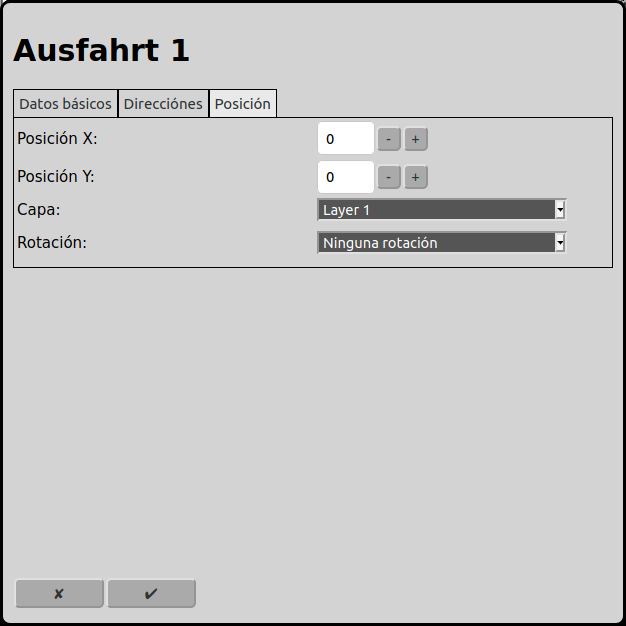

# Configuración de las señales
En la pantalla principal se puede ir a la configuración de las señales con el icono .

## Datos básicos

### Nombre
Cada señal necesita un nombre inequívoco. Si el nombre no está indicado RailControl crea un nombre. Si el nombre ya existe RailControl añade un numero al nombre para hacer el nombre inequívoco.

### Orientación
Obsoleto. Solamente está mostrado si ya hay señales configurado como inicio o destino en una ruta. Estaré eliminado en versiones futuras.

Por favor, reemplaza esta señal con una vía en la ruta y asocia esta señal con la vía.

### Control
Si hay más que un control configurado en RailControl, se tiene que seleccionar el control que controla la señal. Si solamente un control está configurado en RailControl el campo de selección no está visible.

### Typo
RailControl conoce los siguientes typos de señales (otros typos siguen):

Simple izquierda: Esta señal conoce solamente los dos aspectos "parada" y "vía libre". La señal está posicionado a la izquierda de la vía.

Simple derecha: Esta señal conoce solamente los dos aspectos "parada" y "vía libre". La señal está posicionado a la derecha de la vía.

Suiza enana: La seńal enana de Suiza conoce los aspectos "parada", "vía libre" y "cuidado". Vea también: Swiss railway signaling.

Suiza L principal: La seńal principal tipo L de Suiza conoce los aspectos "parada", "vía libre", "40 km/h", "60 km/h", "90 km/h" y "vía libre corta". Vea también: Swiss railway signaling.

Alemania Ks: La seńal Ks conoce los aspectos "parada", "vía libre", "maniobrar", "cuidado", "oscura" y "parada esperada".

### Longitud
Obsoleto. Solamente está mostrado si ya hay señales configurado como inicio o destino en una ruta. Estaré eliminado en versiones futuras.

Por favor, reemplaza esta señal con una vía en la ruta y asocia esta señal con la vía.

### Control
Si hay más que un control configurado en RailControl, se tiene que seleccionar el control que controla la señal. Si solamente un control está configurado en RailControl el campo de selección no está visible.

### Protocolo
Si un control soporta más que un protocolo, se tiene que seleccionar el protocolo que controla la señal. Si el control solamente soporta un protocolo, el campo de selección no está visible.

### Dirección basica
La dirección basica que controla la señal. En "Direcciones" se puede entrar la dirección de cada aspecto de la señal. La dirección basica es la dirección más bajo que se puede usar.

### Duración de conmutación (ms)
Después del procedimiento de conmutación se tiene que apagar los accesorios. Se puede apagar los nuevos accesorios después de 100ms. A veces accesorios más viejos o lentos necesitan 250ms. Algunos controles apagan los accesorios automáticamente con un valor que se puede configurar directamente por el control. En este caso se puede configurar 0ms aquí. 

### Invertido
Cuando los conectores del accesorio están conectado invertido, RailControl puede invertir otra vez.

## Direcciones

Depende del type del señal elegido en "Datos basicos" los aspectos posibles están mostrados aquí. Para cada aspecto se puede elegir una dirección. La dirección más bajo es la dirección basica elegido en "Datos basicos". Por defecto las dirección están elegido en ordenación ascendente empezando con la dirección basica.

## Position

 
### Posición X
La posición del elemento en cuadros deste la izquierda en el diagrama de vías. Se empieza a contar con zero. Si un elemento es más grande que un cuadrado el cuadrado izquierda arriba es importante para contar.

### Posición Y
La posición del elemento en cuadros deste arriba en el diagrama de vías. Se empieza a contar con zero. Si un elemento es más grande que un cuadrado el cuadrado izquierda arriba es importante para contar.

### Capa
La capa en que el elemento está visible.

### Rotación
Se puede rotar los elementos en pasos de 90 grados.

## Retroseñales
Obsoleto. Solamente está mostrado si ya hay retroseñales configurado. Estaré eliminado en versiones futuras.

Por favor, elimina las retroseñales configurado.

### Autómode
Obsoleto. Solamente está mostrado si ya hay señales configurado como inicio o destino en una ruta. Estaré eliminado en versiones futuras.

Por favor, reemplaza esta señal con una vía en la ruta y asocia esta señal con la vía.

