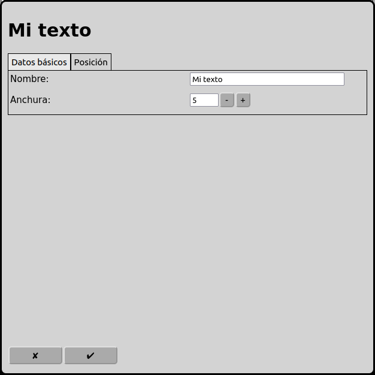
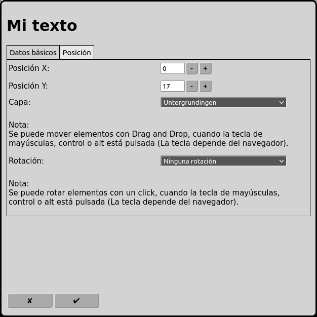

# Configuración de los textos
En la pantalla principal se puede ir a la configuración de los textos con el icono .

## Datos básicos

### Nombre
Cada señal necesita un nombre inequívoco.

El nombre es también mostrado en el diagrama de vías.

Si el nombre no está indicado RailControl crea un nombre. Si el nombre ya existe RailControl añade un numero al nombre para hacer el nombre inequívoco.

### Anchura
La anchura del texto es limitado.

## Position

 
### Posición X
La posición del elemento en cuadros deste la izquierda en el diagrama de vías. Se empieza a contar con zero. Si un elemento es más grande que un cuadrado el cuadrado izquierda arriba es importante para contar.

### Posición Y
La posición del elemento en cuadros deste arriba en el diagrama de vías. Se empieza a contar con zero. Si un elemento es más grande que un cuadrado el cuadrado izquierda arriba es importante para contar.

### Capa
La capa en que el elemento está visible.

### Rotación
Se puede rotar los elementos en pasos de 90 grados.

