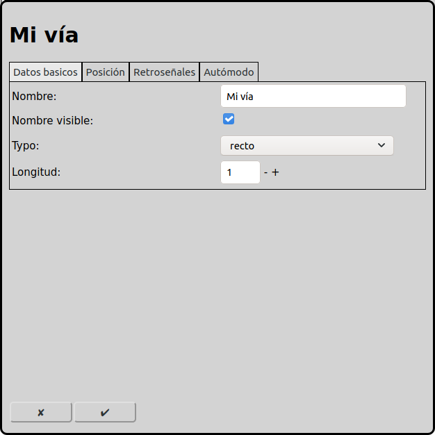
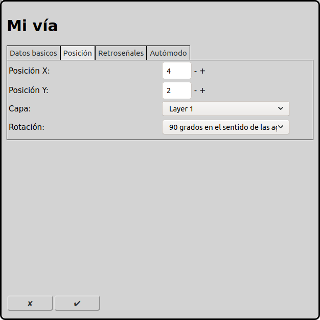
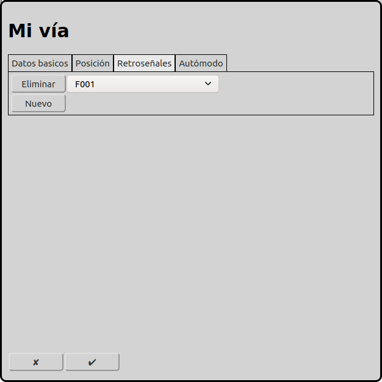
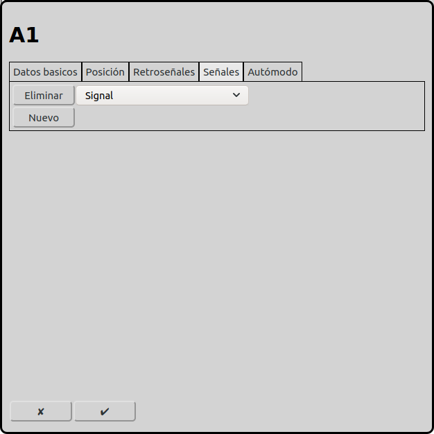
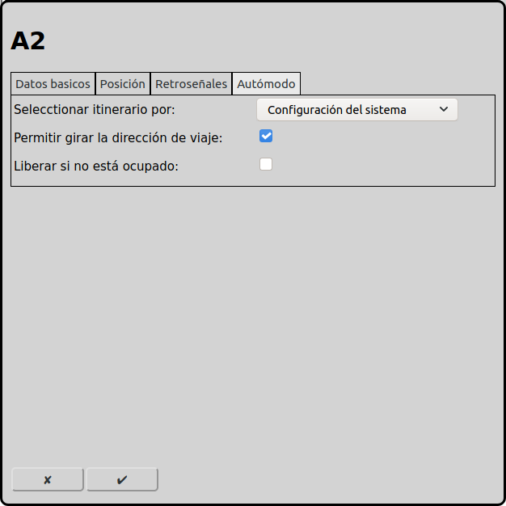

# Configuración de las vías
En la pantalla principal se puede ir a la configuración de las vías con el icono .

En el diagrama de las vías los elementos vías son muy importante. Con los elementos vías se puede designar el diagrama. También las vías son muy importante en el modo automatico, porque todos los itinerarios empiezan o terminan en una vía os una señal.

## Datos basicos

### Tipo
RailControl conoce distintos tipos de vías:

recto: Una vía recta. Está recomendado de usar esto para el inicio o destino de itinerarios. Principalmente se puede usar también todos los otros tipos de vías.

curvo: Una vía que está diagonal en el diagrama de vías.

Final / Tope: Significa el fin de una vía o un tope.

Puente: Significa un puente.

Túnel (dos lados): Significa un túnel. Los dos portales están parte del elemento. No se puede usar los cuadros vacíos entre los portales para otros elementos.

Túnel (un lado): Significa un túnel. Hace sentido de usar dos de estos elementos.

Enlace: Significa una vía que está continuado en una otra capa.

Intersección izquerda: Significa un cruce simple sin desvío. Hay una vía recta y una vía diagonal.

Intersección derecha: Significa un cruce simple sin desvío. Hay una vía recta y una vía diagonal.

Intersección simétrico: Significa un cruce simple sin desvío. Hay dos vías diagonal.

### Vía principal
Especialmente en el modo automático, una sección/bloque de vía puede extenderse a lo largo de varias secciones físicas de vía, como puentes y túneles. En este caso, tiene sentido definir una vía principal y adjuntarle las otras vías. Esta vía adjunta se comporta de forma idéntica a la vía principal, es decir, tiene los mismos menús contextuales y la misma iluminación que la vía principal.

### Nombre
Cada vía necesita un nombre inequívoco. Si el nombre no está indicado RailControl crea un nombre. Si el nombre ya existe RailControl añade un numero al nombre para hacer el nombre inequívoco.

### Nombre visible
Se puede seleccionar si se puede mostrar el nombre de un vía recto. Si la vía está el inicio o el destino de un itinerario hace sentido de mostrar el nombre. En la mayoria de los casos para la operación manual los nombres no son importantes.

### Longitud
Algunos tipos de vías permiten seleccionar la longitud. Es el numero de los cuadros que están utilizado para mostrar en el diagrama de vías.

## Posición

### Posición X
La posición del elemento en cuadros deste la izquierda en el diagrama de vías. Se empieza a contar con zero. Si un elemento es más grande que un cuadrado el cuadrado izquierda arriba es importante para contar.

### Posición Y
La posición del elemento en cuadros deste arriba en el diagrama de vías. Se empieza a contar con zero. Si un elemento es más grande que un cuadrado el cuadrado izquierda arriba es importante para contar.

### Capa
La capa en que el elemento está visible.

### Rotación
Se puede rotar los elementos en pasos de 90 grados.

## Retroseñales

Se puede asignar una o más retroseñales a cada vía. Las retroseñales indican la ocupación de la vía. En el autómodo la vía del destino en las itinerarios requieren una retroseñal asignada.

## Señales

Se puede asociar uno o más señales a una vía. Señales asociadas están ponido a indicación parar cuando un itinerario saliendo está liberado o cuando en autómodo "Liberar si no está ocupado" está seleccionado y la vía está liberado (todas las retroseñales están libres).

## Autómodo

 
### Seleccionar itinerario por
En el autómodo RailControl tiene que seleccionar un itinerario para usar. Si hay más itinerarios disponibles RailControl tiene que elegir una posibilidad. Se puede configurar como RailControl elige un itinerario.

Configuración del sistema: Se usa la configuración de las [Opciones generales](#opciones-generales).

No importa: No importa cual itinerario se usa. Normalmente se usa el mismo itinerario.

Aleatorio: Se usa activamente la causalidad.

Vía más corta: Se usa el itinerario con la vía de destino más corta.

El más largo sin usar: Se usa el itinerario que no estuvo usado por el tiempo máximo.

### TODO MISSING TRANSLATION OF Fahrtrichtung der Lokomotive drehen erlauben
Se puede permitir cambiar la orientación de correr en esta vía. Además se necesita un itinerario en la otra dirección y la locomotora necesita ser configurado como tren push-pull.

Esto hace sentido en una estación donde trenes push-pull cambian el sentido de correr.
Liberar si no está ocupado

Se puede liberar una vía cuando todos las retroseñales se han deactivado. Así se puede usar la vía de inicio para el próximo tren, aunque el primer tren todavía no ha llegado a la vía de destino.

Esa opción solamente hace sentido cuando las vías estan observadas en todo con circuitos de vías, contadores de ejes o otros métodos que detectan si una vía está libre.

