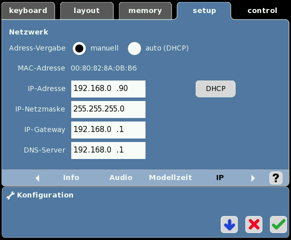
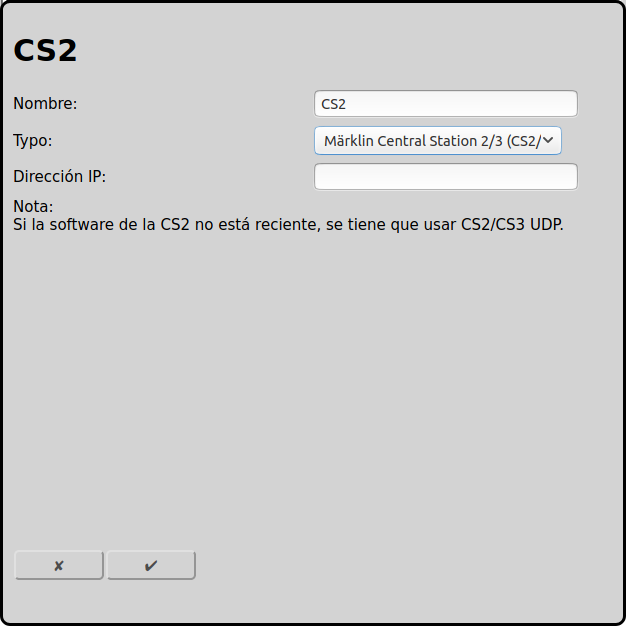

## Configuración de Märklin Central Station 2/3 (CS2/3) con TCP (reciente)

La nueva conexion entre RailControl y Märklin CS2/CS3 es TCP. Está explicado en está pagina.

La vieja [opción UDP](#configuración-de-märklin-central-station-23-cs23-con-udp-anticuado) no es recomendida.

### Configuración CS2/CS3

En Setup/Configuración/IP es nesecario insertar la dirección IP y la máscara de red. La dirección IP es la IP que es nesecario para la configuración de RailControl más tarde. IP-Gateway y servidor DNS solamente son importantes para la actualicación del software.

### Configuratión RailControl

El nombre solamente es importante para reconocer. Especialmente si hay más que un control. Entonces solamente la IP de CS2/CS3 se tiene que insertar:

### Configuratión Firewall

Normalmente la configuración por defecto es suficiente. Solamente la puerta 15731 de TCP para datos saliendos tiene que estar abierta.

