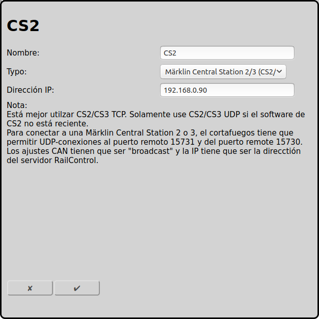

## Configuración de Märklin Central Station 2/3 (CS2/3) con UDP (anticuado)

La vieja opción de conexion entre RailControl y Märklin CS2/CS3 es UDP. Está explicado en está pagina.

La nueva opción de [conexión TCP](#configuración-de-märklin-central-station-23-cs23-con-tcp-reciente) está mejor.

### Configuración CS2/CS3

En Setup/Configuración/IP es nesecario insertar la dirección IP y la máscara de red. La dirección IP es la IP que es nesecario para la configuración de RailControl más tarde. IP-Gateway y servidor DNS solamente son importantes para la actualicación del software.

El CS2/CS3 thiene que saber como se puede conectar a RailControl. En el menu CAN-Gateway se tiene que insertar la dirección IP del servidor RailControl (en ese ejemplo 192.168.0.99).

### Configuratión RailControl

El nombre solamente es importante para reconocer. Especialmente si hay más que un control. Entonces solamente la IP de CS2/CS3 se tiene que insertar:

### Configuratión Firewall

Normalmente la configuración por defecto es suficiente. Solamente la puerta 15731 de TCP para datos saliendos tiene que estar abierta. El cortafuegos tiene que acceptar conexiones UDP de RailControl a la puerta 15731 del CS2/CS3 y conexiones UDP de CS2/CS3 a puerta 15730 de RailControl. Si el red no está conectado con el internet es más facil de apagar el contrafuegos.

