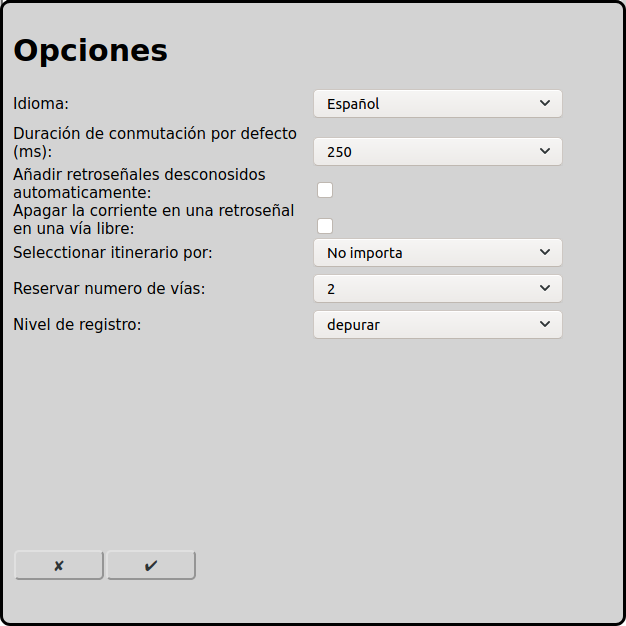

# Opciones generales
Para usar RailControl algunas opciones son necesarias.

En la pantalla principal se puede ir a la configuración de las opciones con el icono :

## Datos básicos
### Idioma
Se puede seleccionar el idioma. Todos los textos se muestran en este idioma.

### Nivel de registro
El nivel de registro que RailControl escribe acciones.

Errores: TODO MISSING TRANSLATION OF Es werden nur schwerwiegende Fehler aufgezeichnet.

Advertencias: TODO MISSING TRANSLATION OF Es werden zusätzlich Warnungen aufgezeichnet, die eine ordentliche Ausführung von RailControl höchstwahrscheinlich verunmöglichen.

Informaciones: TODO MISSING TRANSLATION OF Es werden alle wichtigen Aktionen aufgezeichnet. Diese Einstellung ist empfohlen.

Depurar: TODO MISSING TRANSLATION OF Es werden alle Aktionen aufgezeichnet. Insbesondere für die Fehlersuche ist diese Einstellung sinnvoll.

## Iniciar
### Inicialicación de las locomotoras
Las locomotoras pueden inicializarse al iniciar RailControl. La velocidad se establece en 0 para todas las locomotoras y las funciones se establecen en los últimos estados conocidos.

Sin inicialización: Las locomotoras no se inicializan al arrancar RailControl.

Sólo velocidad: La velocidad de las locomotoras se pone a 0 al arrancar RailControl.

Velocidad y funciones: La velocidad de las locomotoras se pone a 0 al arrancar RailControl y las funciones se establecen a los últimos estados conocidos.

## Retroseñal
### Añadir retroseñales desconosidas automaticamente
La mayoría de los controls automáticamente informan a RailControl de [retroseñales](#configuración-de-las-retroseñales) encendidos sin configurar en RailControl. RailControl puede usar esta información para configurar automáticamente.

### Apagar la corriente en una retroseñal en una vía libre
RailControl puede apagar la corriente y bloquear una vía, si una retroseñal está activada en esta vía pero RailControl no espera un tren.

## Accesorio
### Duración de conmutación por defecto (ms)
Después del procedimiento de conmutación se tiene que apagar los accesorios. Se puede apagar los nuevas accesorios despues de 100ms. Más viejos o lentos accesorios a veces necesitan 250ms. Algunos controles apagan los accesorios automáticamente con un valor que se puede configurar directamente por el control. En este caso se puede configurar 0ms aquí.

## Autómodo
### Seleccionar itinerario por
En el modo automático RailControl tiene que elegir cual itinerario que usar. Hay diferentes conceptos disponibles. Itinerarios en uso nunca están elegido.

No importa: Se elige un itinerario por causalidad. Normalmente siempre se elige el mismo itinerario.

Vía más corta: Se elige el itinerario con la vía de destino más corta.

El más largo sin usar: Se elige el itinerario que no está usado lo más largo.

### Reservar numero de vías
El numero de itinerarios que están reservado en el modo automático. Si se reserva solamente un itinerario el tren pare al fin de cada itinerario.

