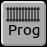
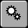
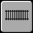
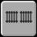
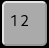

# Descargar
Se puede descargar RailControl de la pagina [Download](https://www.railcontrol.org/index.php/es/download-es).

# Instalación
Se puede extraer el archivo descargado en qualquier lugar de la computadora.

## Instalación en Windows
En Windows se tiene que extraer el archivo en una subcarpeta. D:\\ no vale, D:\\Modelismo está bien.

## Instalación en  Debian GNU/Linux

Deste Debian GNU/Linux 13 "trixie" RailControl está incluido en Debian. Se puede installar con este commando:

```
sudo apt install railcontrol
```

**Nota:** La documentación específica de Debian se encuentra en el directorio
`/usr/share/doc/railcontrol`.

# Fichero de la configuración
En el archivo extraido hay una plantilla de archivo de la configuración (railcontrol.conf.dist). Durante el primero inicio de RailControl la plantilla está copiado a railcontrol.conf. Normalmente no es necesario cambiar algo en el archivo de configuración.

# Arrancar RailControl
Con un doble clic en railcontrol.exe (Windows) o railcontrol (otras sistemas) se puede poner en marcha RailControl. Está recomendado utilizar RailControl en un terminal para recibir más informaciones sobre RailControl. Tambien en un terminal se puede cambiar el funcionamiento de Railcontrol con argumentos de inicio.

# Terminar RailControl
Se puede terminar RailControl por entrar q+Enter o Ctrl+C en el terminal de RailControl o usar el botón en el navegador internet.

**Importante: Usar la X arriba en la derecha del terminal de RailControl puede dar problemas para guardar los ajustes y puede dar problemas para arrancar Railcontrol otra vez.**

Entrar q+Enter o Ctrl+C en el terminal o usar el botton en el navegador multiples veces va a terminar RailControl de inmediatamente. Usa eso opción solamente si RailControl no termina correctamente.

# Navegador Internet
Despues poner RailControl en marcha, se puede conectar a RailControl con un navegador internet actual. RailControl muestra los enlaces posibles durante el inicio. Se puede copiar uno de los enlaces al navegador internet. Los enlaces con localhost, 127.0.0.1 y [::1] solamente funcionan en el mismo dispositivo como RailControl.

# Funciones y configuración
Las funciones importantes y la configuración son accesibles en la barra de menú:

Desde la izquierda hasta la derecha son:

  
Acabar el servidor RailControl (con parar todos los trenes)

  
Encender y apagar la corriente de vía

  
Parar todos los trenes inmediatamente (velocidad cero)

  
Parar todos los trenes en el modo automático al fin del itinerario

  
Poner todos los trenes en el modo automático

  
Mostrar RailControl en modo pantalla completa

  
Programación CV. Se muestra solamente si el control y su API lo admiten

  
En pantallas estrechas se puede mostrar la segunda parte del menú

  
[Opciones generales](#opciones-generales)

  
[Configuración de los controles](#configuración-de-los-controles)

  
[Configuración de las locomotoras](#configuración-de-las-locomotoras)

  
[Configuración de las unidades múltiples](#configuración-de-las-unidades-múltiples)

  
[Configuración de las capas](#configuración-de-las-capas)

  
[Configuración de las vías](#configuración-de-las-vías)

  
[Configuración de los grupos de vía](#configuración-de-los-grupos-de-vía)

  
[Configuración de los desvíos](#configuración-de-los-desvíos)

  
[Configuración de las señales](#configuración-de-las-señales)

  
[Configuración de los accesorios](#configuración-de-los-accesorios)

  
[Configuración de las retroseñales](#configuración-de-las-retroseñales)

  
[Configuración de los itinerarios](#configuración-de-los-itinerarios)

  
TODO Configuration of counters and linkage to section

  
[Configuración de los textos](#configuración-de-los-textos)

